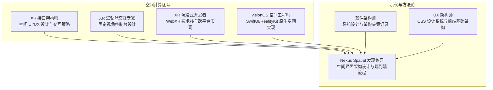
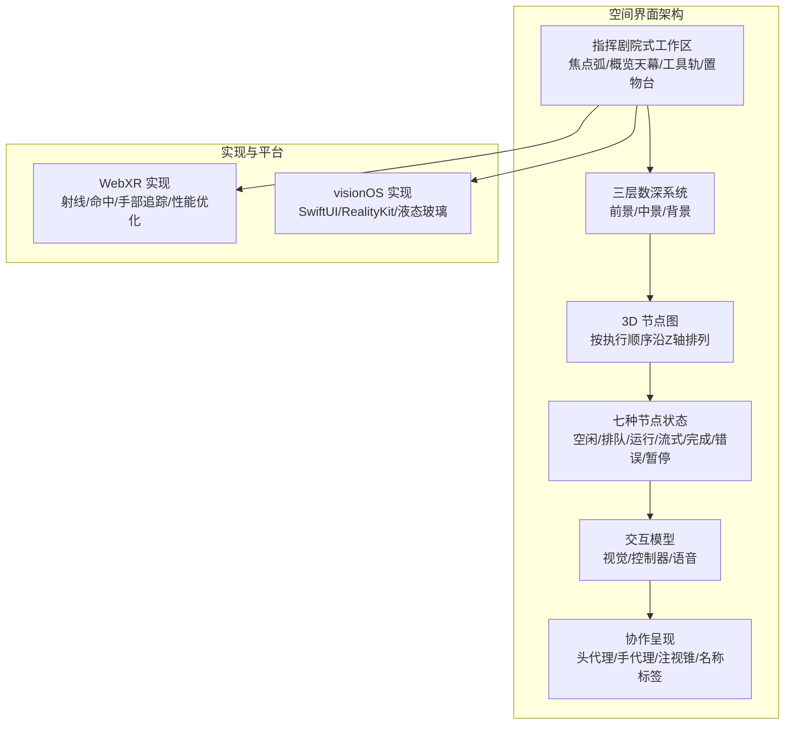
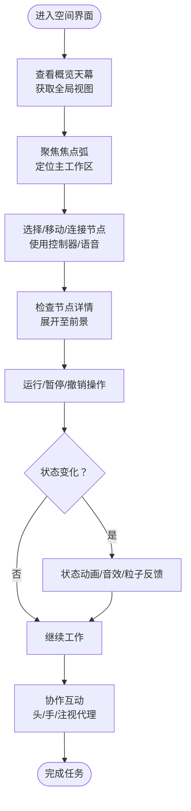
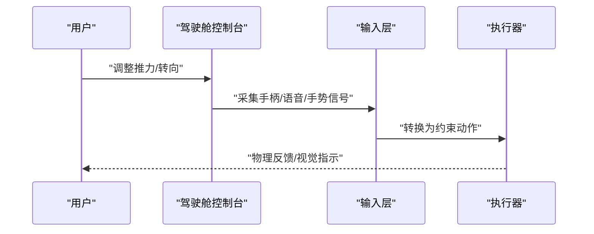
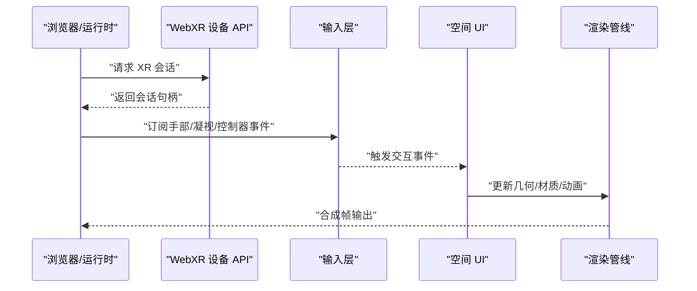
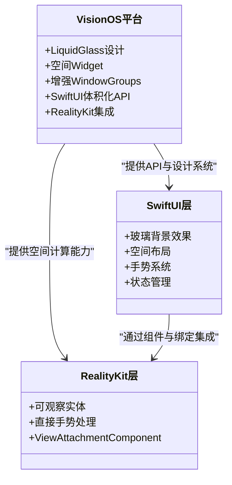
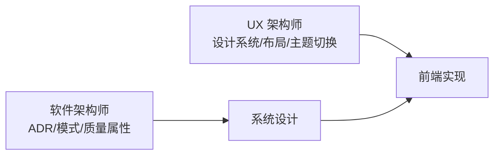
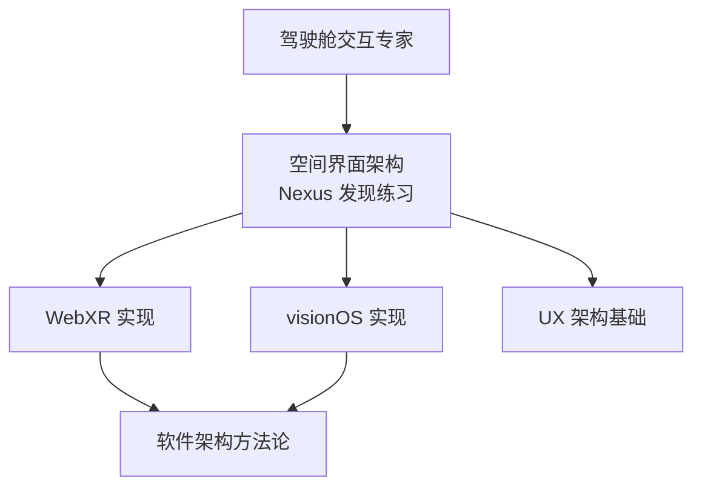

# XR 接口架构师

<cite>
**本文引用的文件**
- [xr-interface-architect.md](file://spatial-computing/xr-interface-architect.md)
- [xr-cockpit-interaction-specialist.md](file://spatial-computing/xr-cockpit-interaction-specialist.md)
- [xr-immersive-developer.md](file://spatial-computing/xr-immersive-developer.md)
- [visionos-spatial-engineer.md](file://spatial-computing/visionos-spatial-engineer.md)
- [nexus-spatial-discovery.md](file://examples/nexus-spatial-discovery.md)
- [engineering-software-architect.md](file://engineering/engineering-software-architect.md)
- [design-ux-architect.md](file://design/design-ux-architect.md)
</cite>

## 目录
1. [简介](#简介)
2. [项目结构](#项目结构)
3. [核心组件](#核心组件)
4. [架构总览](#架构总览)
5. [详细组件分析](#详细组件分析)
6. [依赖关系分析](#依赖关系分析)
7. [性能考量](#性能考量)
8. [故障排查指南](#故障排查指南)
9. [结论](#结论)
10. [附录](#附录)

## 简介
本文件面向 XR 接口架构师代理，系统化阐述其在 XR 系统架构设计与接口规划中的专业能力。内容覆盖模块化设计、组件解耦、数据流管理、状态同步等核心架构要素；深入解析空间 UI 组件、交互层抽象、事件处理机制与响应式设计的技术实现；提供扩展性设计指导（插件架构、API 设计、版本兼容、性能监控）；并通过关键设计模式（观察者、状态机、命令等）在空间计算环境中的应用，平衡用户体验与技术实现，确保系统稳定性、可维护性与可扩展性。

## 项目结构
XR 接口架构师代理位于 spatial-computing 目录下，围绕“空间接口”“驾驶舱交互”“沉浸式开发”“visionOS 空间工程”四个维度协同工作，并与示例项目 Nexus Spatial 的“空间界面架构”形成跨代理协作闭环。同时，软件架构与 UX 架构代理为系统提供通用的架构设计方法论与前端基础能力支撑。

**图表来源**
- [xr-interface-architect.md:1-33](file://spatial-computing/xr-interface-architect.md#L1-L33)
- [xr-cockpit-interaction-specialist.md:1-33](file://spatial-computing/xr-cockpit-interaction-specialist.md#L1-L33)
- [xr-immersive-developer.md:1-33](file://spatial-computing/xr-immersive-developer.md#L1-L33)
- [visionos-spatial-engineer.md:1-54](file://spatial-computing/visionos-spatial-engineer.md#L1-L54)
- [nexus-spatial-discovery.md:680-800](file://examples/nexus-spatial-discovery.md#L680-L800)
- [engineering-software-architect.md:1-82](file://engineering/engineering-software-architect.md#L1-L82)
- [design-ux-architect.md:1-469](file://design/design-ux-architect.md#L1-L469)

**章节来源**
- [xr-interface-architect.md:1-33](file://spatial-computing/xr-interface-architect.md#L1-L33)
- [xr-cockpit-interaction-specialist.md:1-33](file://spatial-computing/xr-cockpit-interaction-specialist.md#L1-L33)
- [xr-immersive-developer.md:1-33](file://spatial-computing/xr-immersive-developer.md#L1-L33)
- [visionos-spatial-engineer.md:1-54](file://spatial-computing/visionos-spatial-engineer.md#L1-L54)
- [nexus-spatial-discovery.md:680-800](file://examples/nexus-spatial-discovery.md#L680-L800)
- [engineering-software-architect.md:1-82](file://engineering/engineering-software-architect.md#L1-L82)
- [design-ux-architect.md:1-469](file://design/design-ux-architect.md#L1-L469)

## 核心组件
- 空间界面架构与交互策略：定义空间 UI 的层级深度、节点图布局、交互模型与协作呈现，确保在不同平台（VisionOS、WebXR）上的一致体验与性能。
- 驾驶舱交互系统：针对固定视角、高沉浸场景下的控制台设计，强调舒适度与自然的人机交互约束。
- 沉浸式开发框架：基于 WebXR 的跨平台实现，支持手部追踪、射线投射、命中测试与实时物理，兼顾兼容性与降级策略。
- visionOS 原生空间工程：利用 SwiftUI/RealityKit 的原生能力，构建液态玻璃（Liquid Glass）设计体系与体积化界面。
- 软件架构与 UX 架构：提供系统设计方法论（ADR）、质量属性分析与前端设计系统，保障可演进性与可维护性。

**章节来源**
- [xr-interface-architect.md:19-33](file://spatial-computing/xr-interface-architect.md#L19-L33)
- [xr-cockpit-interaction-specialist.md:19-33](file://spatial-computing/xr-cockpit-interaction-specialist.md#L19-L33)
- [xr-immersive-developer.md:19-33](file://spatial-computing/xr-immersive-developer.md#L19-L33)
- [visionos-spatial-engineer.md:13-38](file://spatial-computing/visionos-spatial-engineer.md#L13-L38)
- [engineering-software-architect.md:19-36](file://engineering/engineering-software-architect.md#L19-L36)
- [design-ux-architect.md:19-47](file://design/design-ux-architect.md#L19-L47)

## 架构总览
XR 接口架构师代理以“空间界面架构”为核心，结合“驾驶舱交互”“沉浸式开发”“visionOS 工程”与“软件/UX 架构”的方法论，形成从概念到落地的全链路设计与实施路径。系统采用多客户端形态（WebXR、VisionOS），通过统一的交互语言与状态机驱动，实现跨平台一致的空间体验。

**图表来源**
- [nexus-spatial-discovery.md:684-800](file://examples/nexus-spatial-discovery.md#L684-L800)
- [xr-immersive-developer.md:19-33](file://spatial-computing/xr-immersive-developer.md#L19-L33)
- [visionos-spatial-engineer.md:13-38](file://spatial-computing/visionos-spatial-engineer.md#L13-L38)

**章节来源**
- [nexus-spatial-discovery.md:684-800](file://examples/nexus-spatial-discovery.md#L684-L800)
- [xr-immersive-developer.md:19-33](file://spatial-computing/xr-immersive-developer.md#L19-L33)
- [visionos-spatial-engineer.md:13-38](file://spatial-computing/visionos-spatial-engineer.md#L13-L38)

## 详细组件分析

### 空间界面架构与交互策略
- 指挥剧院式工作区：以用户为中心的曲面剧场布局，包含焦点弧（主工作区）、概览天幕（拓扑总览）、工具轨（库/监控/日志）与置物台（快捷操作）。该布局遵循“远近有度、左右分治、上下分层”的空间组织原则，降低认知负荷并提升沉浸感。
- 三层数深系统：前景（0.8-1.2m，活动面板/检查器）、中景（1.2-2.5m，节点图/连接）、背景（2.5-5.0m，概览地图/环境状态），配合不透明度与视觉权重，实现层次清晰、信息密度可控。
- 节点图 3D 布局：数据流向朝向用户，按执行顺序沿 Z 轴分层；并行分支沿 X 轴展开，条件分支沿 Y 轴展开；节点具备多 LOD（静止/悬停/选中），连接以发光管呈现，颜色编码数据类型并伴随粒子流动。
- 节点状态机：七种状态以边光、内色、声音与粒子反馈表达，确保在空间中快速识别与理解节点健康状况。
- 交互模型：针对 VisionOS、WebXR 控制器与语音输入，给出统一的动作映射（选择/移动/连接/平移/缩放/检查/运行/撤销），保证跨模态一致性。
- 协作呈现：以头代理、手代理、注视锥与名称标签表达他人位置与意图，冲突时采用写锁与复制策略，保障多人协作的确定性与友好性。

**图表来源**
- [nexus-spatial-discovery.md:684-800](file://examples/nexus-spatial-discovery.md#L684-L800)

**章节来源**
- [nexus-spatial-discovery.md:684-800](file://examples/nexus-spatial-discovery.md#L684-L800)

### 驾驶舱交互系统
- 固定视角控制台：强调“坐姿稳定、自然流线”的交互设计，将手控杆、推力杆、开关、仪表盘等实体化控制与空间锚定结合，减少晕动症风险。
- 多输入融合：手部/语音/凝视/物理道具的多模态输入，提供冗余与容错，确保在高沉浸状态下仍能高效完成精细操作。
- 约束驱动控制：避免自由漂浮运动，通过约束与反馈增强真实感与可预测性。

**图表来源**
- [xr-cockpit-interaction-specialist.md:19-33](file://spatial-computing/xr-cockpit-interaction-specialist.md#L19-L33)

**章节来源**
- [xr-cockpit-interaction-specialist.md:19-33](file://spatial-computing/xr-cockpit-interaction-specialist.md#L19-L33)

### 沉浸式开发框架（WebXR）
- 全栈 WebXR 支持：集成手部追踪、捏合、凝视与控制器输入，使用射线投射与命中测试实现直观交互，结合遮挡剔除、着色器调优与 LOD 系统优化性能。
- 兼容性与降级：提供跨设备（Meta Quest、Vision Pro、HoloLens、移动端 AR）的兼容层与优雅降级策略，确保在不同浏览器与运行时环境中稳定可用。
- 模块化组件：以组件驱动的 XR 体验，清晰的回退支持与可插拔接口，便于扩展与维护。

**图表来源**
- [xr-immersive-developer.md:19-33](file://spatial-computing/xr-immersive-developer.md#L19-L33)

**章节来源**
- [xr-immersive-developer.md:19-33](file://spatial-computing/xr-immersive-developer.md#L19-L33)

### visionOS 原生空间工程
- 平台特性：Liquid Glass 设计系统、空间小部件、增强型 WindowGroups、SwiftUI 体积化 API、RealityKit-SwiftUI 集成。
- 技术能力：多窗口架构、空间 UI 模式、性能优化（GPU 效率）、无障碍（VoiceOver 与空间导航）。
- 开发重点：玻璃背景效果、空间布局、手势系统、状态管理与可观测模式，遵循 Apple 原生空间计算最佳实践。

**图表来源**
- [visionos-spatial-engineer.md:13-38](file://spatial-computing/visionos-spatial-engineer.md#L13-L38)

**章节来源**
- [visionos-spatial-engineer.md:13-38](file://spatial-computing/visionos-spatial-engineer.md#L13-L38)

### 软件架构与 UX 架构支撑
- 软件架构师：提供领域建模、架构模式选择、质量属性分析与 ADR 记录模板，确保系统在可维护性、可扩展性与演进性之间取得平衡。
- UX 架构师：建立 CSS 设计系统、布局框架与主题切换机制，提供可复用的组件模板与开发者交接规范，保障前端一致性与可扩展性。

**图表来源**
- [engineering-software-architect.md:37-82](file://engineering/engineering-software-architect.md#L37-L82)
- [design-ux-architect.md:64-295](file://design/design-ux-architect.md#L64-L295)

**章节来源**
- [engineering-software-architect.md:37-82](file://engineering/engineering-software-architect.md#L37-L82)
- [design-ux-architect.md:64-295](file://design/design-ux-architect.md#L64-L295)

## 依赖关系分析
XR 接口架构师代理的依赖关系体现为“概念—实现—平台—方法论”的四层协同：
- 概念层：空间界面架构（Nexus Spatial 发现练习）定义工作区、层级、节点与交互。
- 实现层：WebXR 与 visionOS 分别承担跨平台与原生实现，共享统一交互语言与状态机。
- 方法论层：软件架构与 UX 架构提供设计记录与前端基础设施，确保系统可演进与可维护。
- 协同层：驾驶舱交互专家负责固定视角控制台设计，与空间界面架构互补。

**图表来源**
- [nexus-spatial-discovery.md:680-800](file://examples/nexus-spatial-discovery.md#L680-L800)
- [xr-immersive-developer.md:19-33](file://spatial-computing/xr-immersive-developer.md#L19-L33)
- [visionos-spatial-engineer.md:13-38](file://spatial-computing/visionos-spatial-engineer.md#L13-L38)
- [engineering-software-architect.md:19-36](file://engineering/engineering-software-architect.md#L19-L36)
- [design-ux-architect.md:19-47](file://design/design-ux-architect.md#L19-L47)
- [xr-cockpit-interaction-specialist.md:19-33](file://spatial-computing/xr-cockpit-interaction-specialist.md#L19-L33)

**章节来源**
- [nexus-spatial-discovery.md:680-800](file://examples/nexus-spatial-discovery.md#L680-L800)
- [xr-immersive-developer.md:19-33](file://spatial-computing/xr-immersive-developer.md#L19-L33)
- [visionos-spatial-engineer.md:13-38](file://spatial-computing/visionos-spatial-engineer.md#L13-L38)
- [engineering-software-architect.md:19-36](file://engineering/engineering-software-architect.md#L19-L36)
- [design-ux-architect.md:19-47](file://design/design-ux-architect.md#L19-L47)
- [xr-cockpit-interaction-specialist.md:19-33](file://spatial-computing/xr-cockpit-interaction-specialist.md#L19-L33)

## 性能考量
- 渲染与资源：WebXR 侧采用遮挡剔除、着色器优化与 LOD 系统；visionOS 侧利用 Metal 渲染优化与多玻璃窗口的 GPU 效率。
- 交互延迟：输入层需满足人体工学阈值与可感知延迟容忍度，确保在空间交互中保持流畅与自然。
- 可访问性：提供高对比度、无闪烁、深度扁平化与语音导航等选项，满足不同用户的使用需求。
- 兼容性与降级：在不同浏览器与设备上提供一致的体验与优雅降级策略，避免功能缺失导致的体验割裂。

[本节为通用性能讨论，无需特定文件引用]

## 故障排查指南
- 输入异常：检查射线/命中测试是否正确配置，确认手部追踪与控制器状态；在 WebXR 与 visionOS 上分别验证事件流。
- 性能抖动：评估节点数量与连接复杂度，启用 LOD 与实例化渲染；在复杂场景下减少粒子与动态效果。
- 协作冲突：确认写锁与复制策略生效，检查名称标签与代理状态同步；必要时进行快照恢复或重连。
- 无障碍问题：验证 VoiceOver 导航与空间元素描述，确保颜色不唯一传达信息，提供替代通道。

**章节来源**
- [xr-immersive-developer.md:28-33](file://spatial-computing/xr-immersive-developer.md#L28-L33)
- [visionos-spatial-engineer.md:22-27](file://spatial-computing/visionos-spatial-engineer.md#L22-L27)
- [nexus-spatial-discovery.md:771-780](file://examples/nexus-spatial-discovery.md#L771-L780)

## 结论
XR 接口架构师代理通过“空间界面架构—沉浸式实现—原生平台—方法论支撑”的协同体系，实现了跨平台、可扩展且可维护的空间计算体验。其核心在于：以用户为中心的空间组织、统一的交互语言与状态机、严格的性能与可访问性约束，以及以 ADR 与设计系统为核心的工程化方法。该体系既满足当前产品需求，也为未来演进预留了充分空间。

[本节为总结性内容，无需特定文件引用]

## 附录
- 关键设计模式在空间计算中的应用
  - 观察者模式：用于状态变更通知（节点状态/协作代理），确保 UI 与逻辑解耦。
  - 状态机：节点状态与交互阶段的建模，使状态转换可视化与可调试。
  - 命令模式：将交互动作封装为可撤销/重做的命令，提升协作与回溯能力。
- 扩展性设计建议
  - 插件架构：以标准化节点类型注册与插件接口，支持第三方扩展。
  - API 设计：统一的事件/状态/资源 API，提供版本前缀与兼容策略。
  - 版本兼容：渐进式引入新平台特性（如 visionOS 26），保留降级路径。
  - 性能监控：在渲染、输入与网络层面设置指标，结合 APM 与日志聚合进行持续优化。

**章节来源**
- [nexus-spatial-discovery.md:198-222](file://examples/nexus-spatial-discovery.md#L198-L222)
- [engineering-software-architect.md:37-82](file://engineering/engineering-software-architect.md#L37-L82)
- [design-ux-architect.md:64-295](file://design/design-ux-architect.md#L64-L295)