# XR 沉浸式开发者

<cite>
**本文引用的文件**
- [xr-immersive-developer.md](file://spatial-computing/xr-immersive-developer.md)
- [xr-interface-architect.md](file://spatial-computing/xr-interface-architect.md)
- [xr-cockpit-interaction-specialist.md](file://spatial-computing/xr-cockpit-interaction-specialist.md)
- [visionos-spatial-engineer.md](file://spatial-computing/visionos-spatial-engineer.md)
- [macos-spatial-metal-engineer.md](file://spatial-computing/macos-spatial-metal-engineer.md)
- [terminal-integration-specialist.md](file://spatial-computing/terminal-integration-specialist.md)
- [README.md](file://README.md)
- [nexus-spatial-discovery.md](file://examples/nexus-spatial-discovery.md)
- [unity-architect.md](file://game-development/unity/unity-architect.md)
- [unreal-systems-engineer.md](file://game-development/unreal-engine/unreal-systems-engineer.md)
</cite>

## 目录
1. [简介](#简介)
2. [项目结构](#项目结构)
3. [核心组件](#核心组件)
4. [架构总览](#架构总览)
5. [详细组件分析](#详细组件分析)
6. [依赖关系分析](#依赖关系分析)
7. [性能考量](#性能考量)
8. [故障排查指南](#故障排查指南)
9. [结论](#结论)
10. [附录](#附录)

## 简介
本文件面向 XR（扩展现实）沉浸式开发者代理，系统梳理其在虚拟现实与增强现实内容创作与交互设计中的专业能力，覆盖技术栈、3D 场景构建、交互原型设计、用户界面适配、平台差异与性能优化、用户体验测试等主题。文档以“空间计算”为主线，结合浏览器端 WebXR、原生 visionOS、以及传统 3D 引擎（Unity/Unreal）的实践路径，给出可落地的工作流与设计原则，并通过真实案例展示从概念到实现的完整闭环。

## 项目结构
该仓库按“部门/职能”组织，XR 相关能力集中在“空间计算部”，并与其他工程、设计、产品、测试等团队协同，形成跨职能的“多代理编排”。XR 领域的关键角色包括：
- XR 沉浸式开发者：WebXR 与浏览器端 AR/VR/XR 应用专家
- XR 接口架构师：空间交互设计与 UX 策略专家
- XR 飞控交互专家：固定视角沉浸式控制系统的专家
- visionOS 空间工程师：Apple Vision Pro 原生空间计算与 SwiftUI 实现
- macOS 空间/Metal 工程师：Swift/Metal 高性能渲染与空间集成
- 终端集成专家：现代 Swift 应用中的终端仿真与 SwiftTerm 集成

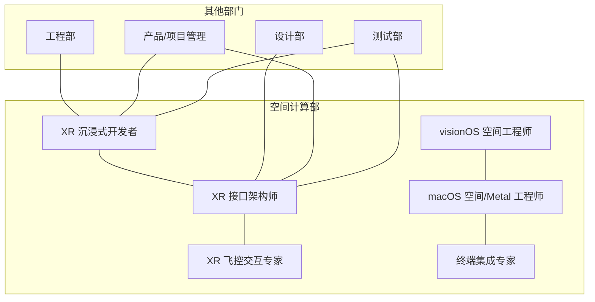

图示来源
- [README.md:236-247](file://README.md#L236-L247)

章节来源
- [README.md:236-247](file://README.md#L236-L247)

## 核心组件
- XR 沉浸式开发者：专注于浏览器端 WebXR，支持手部追踪、捏合、凝视与控制器输入；实现射线投射、命中检测与实时物理；强调性能优化（遮挡剔除、着色器调优、LOD）、设备兼容性（Meta Quest、Vision Pro、HoloLens、移动 AR）与模块化组件驱动的可降级体验。
- XR 接口架构师：空间 UI/UX 设计专家，关注最小化晕动感、增强沉浸感与符合人体行为的交互；定义 HUD、漂浮菜单、面板与交互区域；支持直接触摸、凝视+捏合、控制器与手势输入模型；提供舒适度优先的 UI 放置与多模态输入回退方案。
- XR 飞控交互专家：专注固定视角沉浸式控制台设计，结合真实感与用户舒适度；设计手控操纵杆、推杆与开关，集成多输入 UX（手势、语音、凝视、实体道具）；降低眩晕感，锚定用户视角于坐姿界面；遵循自然的眼-手-头流线。
- visionOS 空间工程师：Apple Vision Pro 原生空间计算专家，基于 SwiftUI/RealityKit 的 Liquid Glass 设计体系；掌握空间小部件、增强 WindowGroups、空间 UI 模式、手势系统与状态管理；强调性能优化与无障碍支持。
- macOS 空间/Metal 工程师：Swift/Metal 高性能渲染与空间集成专家；实现大规模节点（10k-100k）实例化渲染、GPU 物理布局、立体帧流送至 Vision Pro；强调 90fps、热管理、内存池化与 Metal System Trace 性能分析。
- 终端集成专家：SwiftTerm 集成与文本渲染优化专家；支持 VT100/xterm 标准、UTF-8/Unicode、滚动缓冲、SSH 集成；强调可访问性、跨平台渲染（iOS/macOS/visionOS）与电池效率。

章节来源
- [xr-immersive-developer.md:1-33](file://spatial-computing/xr-immersive-developer.md#L1-L33)
- [xr-interface-architect.md:1-33](file://spatial-computing/xr-interface-architect.md#L1-L33)
- [xr-cockpit-interaction-specialist.md:1-33](file://spatial-computing/xr-cockpit-interaction-specialist.md#L1-L33)
- [visionos-spatial-engineer.md:1-54](file://spatial-computing/visionos-spatial-engineer.md#L1-L54)
- [macos-spatial-metal-engineer.md:1-337](file://spatial-computing/macos-spatial-metal-engineer.md#L1-L337)
- [terminal-integration-specialist.md:1-70](file://spatial-computing/terminal-integration-specialist.md#L1-L70)

## 架构总览
XR 沉浸式开发者代理的系统架构由“前端体验层（WebXR/visionOS）—服务层（协作/编排/认证）—数据层（PostgreSQL/Redis/S3/ClickHouse）—AI 提供层（OpenAI/Anthropic/本地模型/插件）”构成。WebXR 客户端采用 React Three Fiber，visionOS 客户端采用 Swift/RealityKit；消息总线使用 NATS JetStream；协作采用 Yjs（CRDT）+ WebRTC；安全包含 OAuth2/JWT、mTLS、凭据加密与沙箱执行。

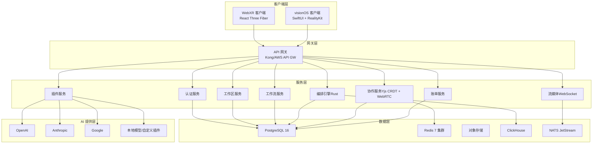

图示来源
- [nexus-spatial-discovery.md:147-173](file://examples/nexus-spatial-discovery.md#L147-L173)

章节来源
- [nexus-spatial-discovery.md:139-250](file://examples/nexus-spatial-discovery.md#L139-L250)

## 详细组件分析

### 组件一：XR 沉浸式开发者（WebXR）
职责与能力
- 浏览器端 WebXR 支持：手部追踪、捏合、凝视、控制器输入
- 沉浸式交互：射线投射、命中检测、实时物理
- 性能优化：遮挡剔除、着色器调优、LOD 系统
- 兼容性：Meta Quest、Vision Pro、HoloLens、移动 AR
- 可靠性：模块化组件驱动、优雅降级

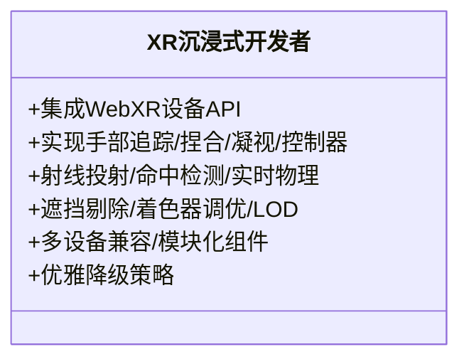

图示来源
- [xr-immersive-developer.md:11-33](file://spatial-computing/xr-immersive-developer.md#L11-L33)

章节来源
- [xr-immersive-developer.md:1-33](file://spatial-computing/xr-immersive-developer.md#L1-L33)

### 组件二：XR 接口架构师（空间 UI/UX）
职责与能力
- 空间 UI 设计：HUD、漂浮菜单、面板、交互区域
- 多输入模型：直接触摸、凝视+捏合、控制器、手势
- 舒适度优先：UI 放置、运动约束、发现性最佳实践
- 交互原型：沉浸式搜索、选择、操控
- 可访问性：多模态输入回退

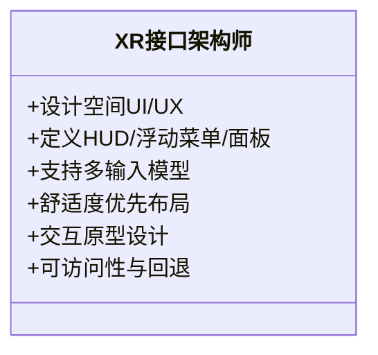

图示来源
- [xr-interface-architect.md:9-33](file://spatial-computing/xr-interface-architect.md#L9-L33)

章节来源
- [xr-interface-architect.md:1-33](file://spatial-computing/xr-interface-architect.md#L1-L33)

### 组件三：XR 飞控交互专家（固定视角沉浸式控制）
职责与能力
- 固定视角控制台：操纵杆、推杆、开关
- 多输入融合：手势、语音、凝视、实体道具
- 舒适度：降低眩晕、锚定坐姿视角
- 自然流线：眼-手-头协调

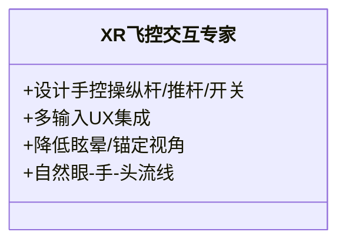

图示来源
- [xr-cockpit-interaction-specialist.md:9-33](file://spatial-computing/xr-cockpit-interaction-specialist.md#L9-L33)

章节来源
- [xr-cockpit-interaction-specialist.md:1-33](file://spatial-computing/xr-cockpit-interaction-specialist.md#L1-L33)

### 组件四：visionOS 空间工程师（原生空间计算）
职责与能力
- Liquid Glass 设计体系：半透明材质、环境自适应
- 空间小部件：空间中吸附到墙面/桌面的持久放置
- 增强 WindowGroups：单实例窗口、体积呈现、空间场景管理
- SwiftUI 空间 API：3D 内容集成、体积内瞬态内容
- 性能与无障碍：GPU 高效渲染、VoiceOver 支持

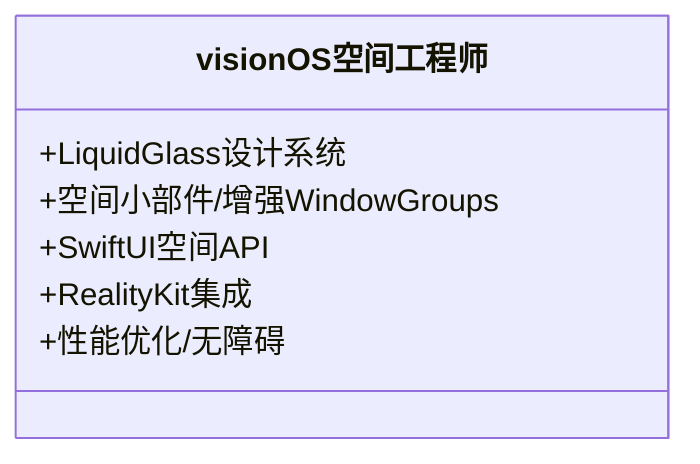

图示来源
- [visionos-spatial-engineer.md:9-54](file://spatial-computing/visionos-spatial-engineer.md#L9-L54)

章节来源
- [visionos-spatial-engineer.md:1-54](file://spatial-computing/visionos-spatial-engineer.md#L1-L54)

### 组件五：macOS 空间/Metal 工程师（高性能渲染）
职责与能力
- 实例化 Metal 渲染：10k-100k 节点 90fps
- GPU 缓冲：图数据（位置、颜色、连接）
- 空间布局算法：力导向、层次、聚类
- Stereo 帧流送：Compositor Services + RemoteImmersiveSpace
- 性能要求：90fps、GPU 利用率 <80%、批处理 <100 次/帧

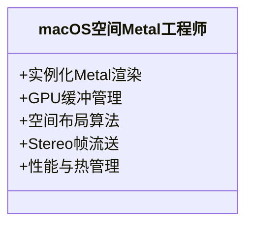

图示来源
- [macos-spatial-metal-engineer.md:9-64](file://spatial-computing/macos-spatial-metal-engineer.md#L9-L64)

章节来源
- [macos-spatial-metal-engineer.md:1-337](file://spatial-computing/macos-spatial-metal-engineer.md#L1-L337)

### 组件六：终端集成专家（SwiftTerm 集成）
职责与能力
- 终端仿真：VT100/xterm、UTF-8/Unicode、滚动缓冲
- SwiftTerm 集成：SwiftUI 嵌入、输入处理、选择复制、主题定制
- 性能优化：Core Graphics 优化、内存管理、后台线程
- SSH 集成：I/O 桥接、连接状态、错误处理、会话管理
- 可访问性：VoiceOver、动态字体、辅助技术

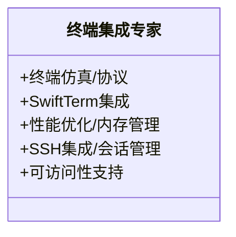

图示来源
- [terminal-integration-specialist.md:9-70](file://spatial-computing/terminal-integration-specialist.md#L9-L70)

章节来源
- [terminal-integration-specialist.md:1-70](file://spatial-computing/terminal-integration-specialist.md#L1-L70)

### 组件七：WebXR 与 3D 引擎（Unity/Unreal）对比
- Unity 架构：ScriptableObject 驱动、事件通道、运行时集合、单一职责组件；强调编辑器友好与设计师可用性。
- Unreal 系统：蓝图/C++ 边界清晰、GAS（能力系统）、Nanite 几何管线、Lumen 光照、内存模型与垃圾回收约束。

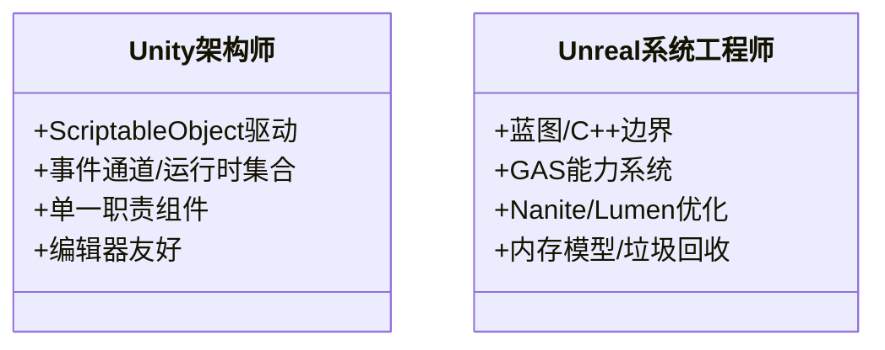

图示来源
- [unity-architect.md:9-55](file://game-development/unity/unity-architect.md#L9-L55)
- [unreal-systems-engineer.md:9-61](file://game-development/unreal-engine/unreal-systems-engineer.md#L9-L61)

章节来源
- [unity-architect.md:1-200](file://game-development/unity/unity-architect.md#L1-L200)
- [unreal-systems-engineer.md:1-200](file://game-development/unreal-engine/unreal-systems-engineer.md#L1-L200)

### 关键流程：WebXR 交互序列
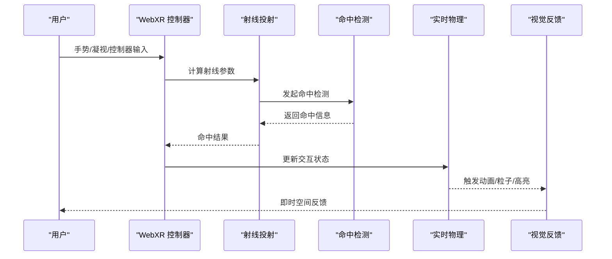

图示来源
- [xr-immersive-developer.md:21-27](file://spatial-computing/xr-immersive-developer.md#L21-L27)

章节来源
- [xr-immersive-developer.md:1-33](file://spatial-computing/xr-immersive-developer.md#L1-L33)

### 关键流程：空间 UI 布局与交互
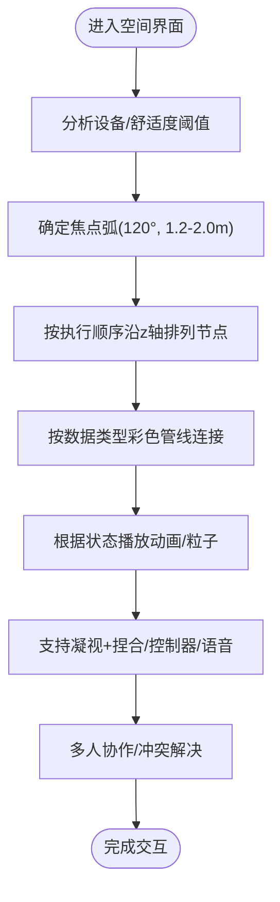

图示来源
- [xr-interface-architect.md:19-33](file://spatial-computing/xr-interface-architect.md#L19-L33)
- [nexus-spatial-discovery.md:680-800](file://examples/nexus-spatial-discovery.md#L680-L800)

章节来源
- [xr-interface-architect.md:1-33](file://spatial-computing/xr-interface-architect.md#L1-L33)
- [nexus-spatial-discovery.md:680-800](file://examples/nexus-spatial-discovery.md#L680-L800)

## 依赖关系分析
- WebXR 与 visionOS 的生态差异：WebXR 更注重跨浏览器兼容与渐进式增强，visionOS 强调原生空间计算与 Liquid Glass 设计。
- 3D 引擎依赖：Unity/Unreal 提供成熟工具链与性能管线，适合复杂场景与大规模资产；WebXR/visionOS 更偏向轻量、可分发的空间体验。
- 数据与协作：WebXR/visionOS 客户端通过 API 网关与服务层交互，协作采用 CRDT（Yjs）保证并发一致性。
- 性能耦合：Metal 渲染与 Compositor Services 对帧率与内存有严格要求，需与空间交互逻辑解耦。

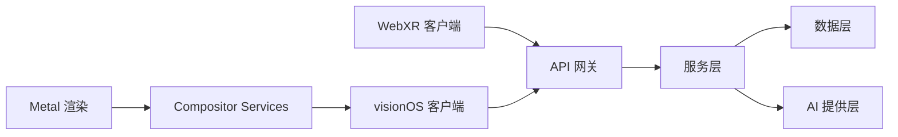

图示来源
- [nexus-spatial-discovery.md:147-173](file://examples/nexus-spatial-discovery.md#L147-L173)
- [macos-spatial-metal-engineer.md:123-166](file://spatial-computing/macos-spatial-metal-engineer.md#L123-L166)

章节来源
- [nexus-spatial-discovery.md:139-250](file://examples/nexus-spatial-discovery.md#L139-L250)
- [macos-spatial-metal-engineer.md:1-337](file://spatial-computing/macos-spatial-metal-engineer.md#L1-L337)

## 性能考量
- WebXR
  - 输入延迟：减少主线程阻塞，使用事件驱动而非每帧更新
  - 渲染开销：遮挡剔除、LOD、批处理、早期深度
  - 设备差异：针对 Quest、Vision Pro、HoloLens 的特性开关与降级策略
- visionOS
  - 帧率与热管理：维持 90fps，GPU 利用率 <80%
  - 空间布局：深度排序、舒适区与调节- Accommodation 限制
- macOS/Metal
  - 实例化渲染：三角带绘制、几何着色器、三重缓冲
  - 资源池化：共享缓冲、ARC 管理、避免 retain cycle
  - Profiling：Metal System Trace、Instruments

章节来源
- [xr-immersive-developer.md:21-27](file://spatial-computing/xr-immersive-developer.md#L21-L27)
- [visionos-spatial-engineer.md:42-57](file://spatial-computing/visionos-spatial-engineer.md#L42-L57)
- [macos-spatial-metal-engineer.md:42-64](file://spatial-computing/macos-spatial-metal-engineer.md#L42-L64)

## 故障排查指南
- WebXR
  - 输入问题：检查浏览器支持矩阵、手部追踪权限、设备兼容性
  - 性能问题：启用遮挡剔除、降低纹理分辨率、减少 draw call
- visionOS
  - 帧率下降：降低视觉细节、关闭非必要特效、检查 Compositor Services 配置
  - 舒适度：调整焦点平面、避免快速旋转与大范围缩放
- macOS/Metal
  - 卡顿：检查 GPU 占用、内存峰值、批处理次数
  - 渲染异常：验证深度纹理、着色器占用、注册表使用
- 协作与同步
  - 冲突：采用 CRDT（Yjs），冲突提示与请求接管
  - 会话：多标签页/多设备状态同步与断线重连

章节来源
- [xr-immersive-developer.md:28-33](file://spatial-computing/xr-immersive-developer.md#L28-L33)
- [visionos-spatial-engineer.md:48-54](file://spatial-computing/visionos-spatial-engineer.md#L48-L54)
- [macos-spatial-metal-engineer.md:58-64](file://spatial-computing/macos-spatial-metal-engineer.md#L58-L64)
- [nexus-spatial-discovery.md:475-483](file://examples/nexus-spatial-discovery.md#L475-L483)

## 结论
XR 沉浸式开发者代理以“空间计算”为核心，贯通浏览器端 WebXR、原生 visionOS 与高性能渲染管线，结合接口架构师的 UX 设计与飞控交互专家的沉浸式控制理念，形成从概念到实现的完整闭环。通过多代理协同与工程化流程，可在保证性能与舒适度的前提下，交付引人入胜的沉浸式体验，提升用户参与度与满意度。

## 附录
- 实战案例：Nexus Spatial（AI Agent 命令中心）展示了多代理编排、技术架构、品牌策略、市场定位与用户体验研究的综合应用。
- 平台差异：WebXR 注重跨平台与渐进式增强；visionOS 强调原生空间计算与设计体系；Unity/Unreal 提供成熟的工具链与性能管线。
- 最佳实践：以用户为中心的空间布局、导航系统、视觉反馈与引导；严格的性能与舒适度阈值；完善的可访问性与降级策略。

章节来源
- [nexus-spatial-discovery.md:1-853](file://examples/nexus-spatial-discovery.md#L1-L853)