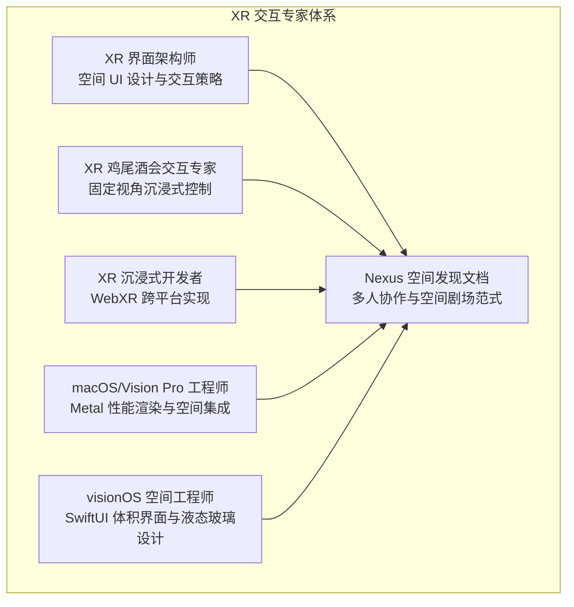
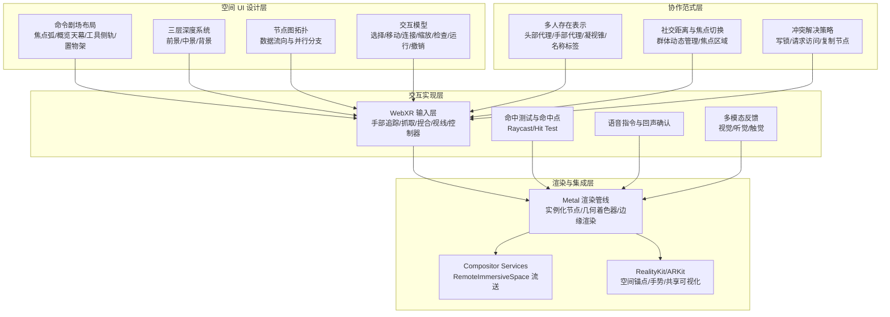
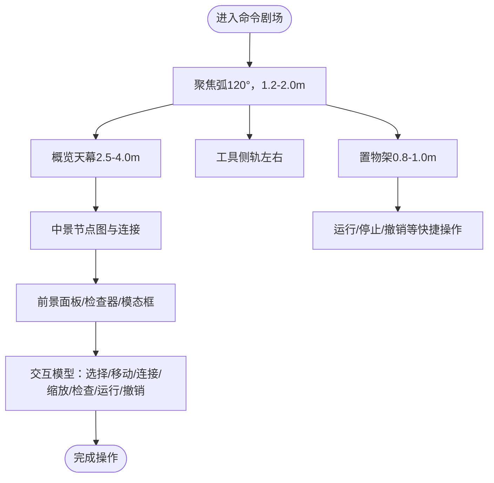
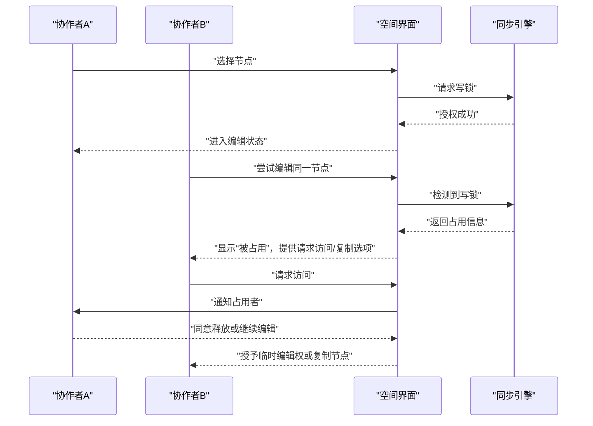
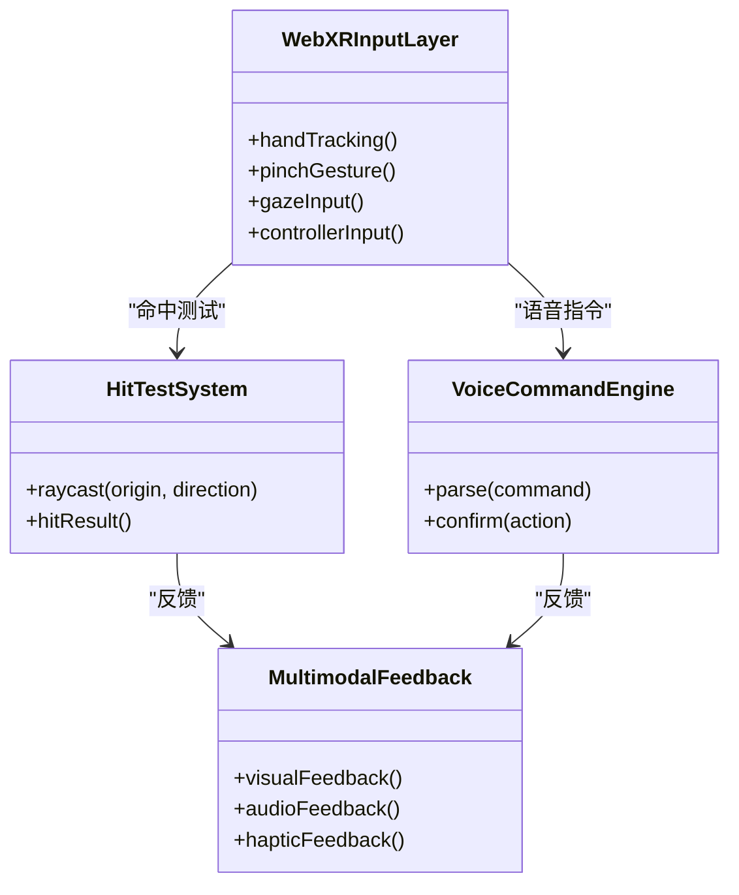
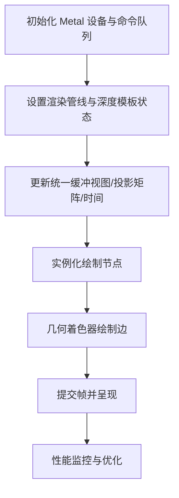
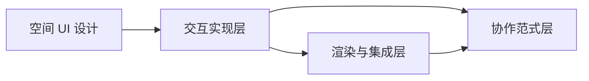

# XR 鸡尾酒会交互专家

<cite>
**本文档引用的文件**
- [xr-cockpit-interaction-specialist.md](file://spatial-computing/xr-cockpit-interaction-specialist.md)
- [xr-interface-architect.md](file://spatial-computing/xr-interface-architect.md)
- [xr-immersive-developer.md](file://spatial-computing/xr-immersive-developer.md)
- [macos-spatial-metal-engineer.md](file://spatial-computing/macos-spatial-metal-engineer.md)
- [visionos-spatial-engineer.md](file://spatial-computing/visionos-spatial-engineer.md)
- [nexus-spatial-discovery.md](file://examples/nexus-spatial-discovery.md)
</cite>

## 目录
1. [简介](#简介)
2. [项目结构](#项目结构)
3. [核心组件](#核心组件)
4. [架构总览](#架构总览)
5. [详细组件分析](#详细组件分析)
6. [依赖关系分析](#依赖关系分析)
7. [性能考虑](#性能考虑)
8. [故障排除指南](#故障排除指南)
9. [结论](#结论)
10. [附录](#附录)

## 简介
本文件面向 XR（扩展现实）环境中的多人协作与空间交互，围绕“XR 鸡尾酒会交互专家”这一角色，系统阐述在多人协作界面设计与空间交互方面的专业能力。文档以 Nexus Spatial 的“空间 AI 运维（SpatialAIOps）”理念为背景，聚焦于多人空间定位、群体动态管理、社交距离维持、焦点切换等复杂交互需求；同时深入解析空间 UI 的设计理念，包括层级组织、信息密度控制、可发现性优化、上下文感知等设计原则，并提供 XR 环境中多人协作的最佳实践，涵盖用户角色分配、任务协调机制、冲突解决策略等。最后展示如何设计直观易用的交互界面，提升多人协作的效率与体验，并介绍空间计算在社交场景中的应用，包括虚拟空间的社交礼仪、隐私保护、无障碍访问等重要考量。

## 项目结构
本仓库包含多个专业领域代理文件，其中与 XR 鸡尾酒会交互专家直接相关的核心文件如下：
- 空间界面架构与交互设计：xr-interface-architect.md
- 鸡尾酒会式交互专家：xr-cockpit-interaction-specialist.md
- WebXR 开发者：xr-immersive-developer.md
- macOS/Vision Pro 渲染与空间工程：macos-spatial-metal-engineer.md、visionos-spatial-engineer.md
- 空间命令剧场与多人协作范式：nexus-spatial-discovery.md

图表来源
- [xr-interface-architect.md:1-33](file://spatial-computing/xr-interface-architect.md#L1-L33)
- [xr-cockpit-interaction-specialist.md:1-33](file://spatial-computing/xr-cockpit-interaction-specialist.md#L1-L33)
- [xr-immersive-developer.md:1-33](file://spatial-computing/xr-immersive-developer.md#L1-L33)
- [macos-spatial-metal-engineer.md:1-337](file://spatial-computing/macos-spatial-metal-engineer.md#L1-L337)
- [visionos-spatial-engineer.md:1-54](file://spatial-computing/visionos-spatial-engineer.md#L1-L54)
- [nexus-spatial-discovery.md:1-853](file://examples/nexus-spatial-discovery.md#L1-L853)

章节来源
- [xr-interface-architect.md:1-33](file://spatial-computing/xr-interface-architect.md#L1-L33)
- [xr-cockpit-interaction-specialist.md:1-33](file://spatial-computing/xr-cockpit-interaction-specialist.md#L1-L33)
- [xr-immersive-developer.md:1-33](file://spatial-computing/xr-immersive-developer.md#L1-L33)
- [macos-spatial-metal-engineer.md:1-337](file://spatial-computing/macos-spatial-metal-engineer.md#L1-L337)
- [visionos-spatial-engineer.md:1-54](file://spatial-computing/visionos-spatial-engineer.md#L1-L54)
- [nexus-spatial-discovery.md:1-853](file://examples/nexus-spatial-discovery.md#L1-L853)

## 核心组件
- XR 界面架构师：负责空间 UI/UX 设计，强调自然交互、舒适度与可发现性，支持多模态输入与可访问性。
- XR 鸡尾酒会交互专家：专注于固定视角沉浸式控制系统的空间交互设计，结合真实感与用户舒适度，整合手势、语音、凝视等多输入方式。
- XR 沉浸式开发者：构建跨浏览器与头显的 WebXR 应用，实现空间交互、命中测试、实时物理与性能优化。
- macOS/Vision Pro 工程师：使用 Metal 实现高性能渲染管线，集成 Compositor Services 与 RemoteImmersiveSpace，处理空间交互与性能指标。
- visionOS 空间工程师：基于 SwiftUI 与 RealityKit 构建体积界面与液态玻璃设计，强调原生空间计算能力与可访问性。
- Nexus 空间发现文档：定义“命令剧场”空间布局、节点图拓扑、协作存在与冲突解决策略，提供多人协作最佳实践。

章节来源
- [xr-interface-architect.md:9-33](file://spatial-computing/xr-interface-architect.md#L9-L33)
- [xr-cockpit-interaction-specialist.md:9-33](file://spatial-computing/xr-cockpit-interaction-specialist.md#L9-L33)
- [xr-immersive-developer.md:9-33](file://spatial-computing/xr-immersive-developer.md#L9-L33)
- [macos-spatial-metal-engineer.md:9-64](file://spatial-computing/macos-spatial-metal-engineer.md#L9-L64)
- [visionos-spatial-engineer.md:9-54](file://spatial-computing/visionos-spatial-engineer.md#L9-L54)
- [nexus-spatial-discovery.md:680-810](file://examples/nexus-spatial-discovery.md#L680-L810)

## 架构总览
XR 鸡尾酒会交互专家的架构由“空间 UI 设计—交互实现—渲染与集成—协作范式”四层构成：
- 空间 UI 设计层：定义空间剧场布局、层级深度系统、节点图拓扑与交互模型。
- 交互实现层：通过 WebXR 与原生空间 API 提供命中测试、手势识别、语音指令与多模态反馈。
- 渲染与集成层：Metal 性能渲染、Compositor Services 流送、RealityKit/ARKit 空间锚点与共享可视化。
- 协作范式层：多人存在表示、社交距离维持、焦点切换与冲突解决策略。

图表来源
- [nexus-spatial-discovery.md:684-711](file://examples/nexus-spatial-discovery.md#L684-L711)
- [nexus-spatial-discovery.md:712-745](file://examples/nexus-spatial-discovery.md#L712-L745)
- [nexus-spatial-discovery.md:758-770](file://examples/nexus-spatial-discovery.md#L758-L770)
- [xr-immersive-developer.md:21-32](file://spatial-computing/xr-immersive-developer.md#L21-L32)
- [macos-spatial-metal-engineer.md:67-121](file://spatial-computing/macos-spatial-metal-engineer.md#L67-L121)
- [macos-spatial-metal-engineer.md:123-166](file://spatial-computing/macos-spatial-metal-engineer.md#L123-L166)
- [nexus-spatial-discovery.md:771-780](file://examples/nexus-spatial-discovery.md#L771-L780)

## 详细组件分析

### 组件一：空间 UI 设计与交互模型
- 命令剧场布局：以用户为中心的曲面剧院式空间，包含焦点弧（120°）、概览天幕、左右工具侧轨与下方置物架，形成“结构化空间分区”。
- 三层深度系统：前景（0.8-1.2m）、中景（1.2-2.5m）、背景（2.5-5.0m），配合不透明度与层级关系，确保信息密度可控与可发现性。
- 节点图拓扑：数据沿 z 轴按执行顺序排列，平行分支沿 x 轴展开，条件分支沿 y 轴展开；连接线采用发光管状，颜色编码数据类型并动画显示流速。
- 交互模型：支持凝视+捏合、控制器触发、语音指令等多种输入；提供平移、缩放、检查面板、运行管道、撤销等操作映射。

图表来源
- [nexus-spatial-discovery.md:684-711](file://examples/nexus-spatial-discovery.md#L684-L711)
- [nexus-spatial-discovery.md:712-745](file://examples/nexus-spatial-discovery.md#L712-L745)
- [nexus-spatial-discovery.md:758-770](file://examples/nexus-spatial-discovery.md#L758-L770)

章节来源
- [nexus-spatial-discovery.md:684-711](file://examples/nexus-spatial-discovery.md#L684-L711)
- [nexus-spatial-discovery.md:712-745](file://examples/nexus-spatial-discovery.md#L712-L745)
- [nexus-spatial-discovery.md:758-770](file://examples/nexus-spatial-discovery.md#L758-L770)

### 组件二：多人协作存在与焦点切换
- 多人存在表示：每个协作者以头部代理（半透明球体，随头部旋转）、手部代理（虚影显示捏合/抓取状态）、凝视锥（10°锥形）与名称标签（随动 billboard）呈现。
- 社交距离与焦点切换：通过群体动态管理与焦点区域划分，维持合理社交距离；在多人协作时，焦点可在不同节点或面板之间切换，避免信息过载。
- 冲突解决策略：采用写锁机制，首个编辑者获得写权限；第二人可见“被占用”提示并可请求访问或复制节点，保障协作效率与一致性。

图表来源
- [nexus-spatial-discovery.md:771-780](file://examples/nexus-spatial-discovery.md#L771-L780)

章节来源
- [nexus-spatial-discovery.md:771-780](file://examples/nexus-spatial-discovery.md#L771-L780)

### 组件三：WebXR 与原生空间交互实现
- WebXR 支持：集成手部追踪、捏合、凝视与控制器输入，实现命中测试与实时物理交互。
- 原生空间集成：Vision Pro 中的 Compositor Services 与 RemoteImmersiveSpace，提供立体输出与空间流送；RealityKit/ARKit 支持空间锚点与共享可视化。
- 交互反馈：通过视觉（发光/动画）、听觉（空间音效/提示音）与触觉（手部反馈）提供多模态反馈，增强沉浸感与可发现性。

图表来源
- [xr-immersive-developer.md:21-32](file://spatial-computing/xr-immersive-developer.md#L21-L32)
- [nexus-spatial-discovery.md:758-770](file://examples/nexus-spatial-discovery.md#L758-L770)

章节来源
- [xr-immersive-developer.md:9-33](file://spatial-computing/xr-immersive-developer.md#L9-L33)
- [nexus-spatial-discovery.md:758-770](file://examples/nexus-spatial-discovery.md#L758-L770)

### 组件四：Metal 渲染与性能优化
- 渲染管线：实例化节点渲染、几何着色器绘制边、GPU 缓冲与统一矩阵更新；通过遮挡剔除、LOD 系统与批处理减少开销。
- Vision Pro 集成：Compositor Services 立体输出配置、RemoteImmersiveSpace 连接、手部追踪与手势识别、空间音频反馈。
- 性能指标：保持 90fps 立体渲染、GPU 利用率低于 80%、内存使用控制在 1GB 以内，确保长时间沉浸体验。

图表来源
- [macos-spatial-metal-engineer.md:67-121](file://spatial-computing/macos-spatial-metal-engineer.md#L67-L121)
- [macos-spatial-metal-engineer.md:123-166](file://spatial-computing/macos-spatial-metal-engineer.md#L123-L166)

章节来源
- [macos-spatial-metal-engineer.md:42-64](file://spatial-computing/macos-spatial-metal-engineer.md#L42-L64)
- [macos-spatial-metal-engineer.md:67-121](file://spatial-computing/macos-spatial-metal-engineer.md#L67-L121)
- [macos-spatial-metal-engineer.md:123-166](file://spatial-computing/macos-spatial-metal-engineer.md#L123-L166)

### 组件五：多人协作最佳实践
- 用户角色分配：明确“观察者/编辑者/审阅者/协调者”等角色职责，结合存在表示与焦点切换进行角色可视化。
- 任务协调机制：通过节点图拓扑与连接线状态，实时反映任务进展；在多人协作时，利用共享面板与空间标注进行任务对齐。
- 冲突解决策略：写锁优先、请求访问与复制节点的弹性机制，确保协作流畅与数据一致。

章节来源
- [nexus-spatial-discovery.md:771-780](file://examples/nexus-spatial-discovery.md#L771-L780)

### 组件六：空间计算在社交场景中的应用
- 社交礼仪：在虚拟空间中遵循“社交距离”与“焦点切换”原则，避免过度拥挤与信息过载；通过凝视锥与名称标签体现关注焦点。
- 隐私保护：在多人协作中提供隐私面板与访问控制，确保敏感数据仅对授权用户可见。
- 无障碍访问：提供多模态输入与可访问性支持（如 VoiceOver、开关控制），确保不同能力用户均可参与协作。

章节来源
- [nexus-spatial-discovery.md:802-810](file://examples/nexus-spatial-discovery.md#L802-L810)
- [macos-spatial-metal-engineer.md:51-56](file://spatial-computing/macos-spatial-metal-engineer.md#L51-L56)

## 依赖关系分析
XR 鸡尾酒会交互专家的依赖关系体现在以下方面：
- 空间 UI 设计依赖交互实现层提供的输入与命中测试能力；
- 交互实现层依赖渲染与集成层的 Metal 渲染与 Vision Pro 流送；
- 协作范式层依赖同步与存在表示，确保多人协作的一致性与可感知性。

图表来源
- [nexus-spatial-discovery.md:684-711](file://examples/nexus-spatial-discovery.md#L684-L711)
- [xr-immersive-developer.md:21-32](file://spatial-computing/xr-immersive-developer.md#L21-L32)
- [macos-spatial-metal-engineer.md:67-121](file://spatial-computing/macos-spatial-metal-engineer.md#L67-L121)
- [nexus-spatial-discovery.md:771-780](file://examples/nexus-spatial-discovery.md#L771-L780)

章节来源
- [nexus-spatial-discovery.md:684-711](file://examples/nexus-spatial-discovery.md#L684-L711)
- [xr-immersive-developer.md:21-32](file://spatial-computing/xr-immersive-developer.md#L21-L32)
- [macos-spatial-metal-engineer.md:67-121](file://spatial-computing/macos-spatial-metal-engineer.md#L67-L121)
- [nexus-spatial-discovery.md:771-780](file://examples/nexus-spatial-discovery.md#L771-L780)

## 性能考虑
- 渲染性能：保持 90fps 立体渲染，控制 GPU 利用率与内存占用，采用遮挡剔除、LOD 与批处理优化。
- 交互延迟：降低从凝视到选择的延迟，确保空间交互的即时性与自然感。
- 舒适度：稳定水平面、限制主交互范围、定时休息提示与周边暗角，减少晕动症风险。
- 兼容性：跨浏览器与头显的兼容层设计，提供优雅降级策略。

章节来源
- [macos-spatial-metal-engineer.md:42-64](file://spatial-computing/macos-spatial-metal-engineer.md#L42-L64)
- [nexus-spatial-discovery.md:802-810](file://examples/nexus-spatial-discovery.md#L802-L810)

## 故障排除指南
- 输入问题：检查 WebXR 手部追踪与命中测试是否正常工作，验证控制器与语音指令的回声确认。
- 渲染问题：使用 Metal System Trace 分析帧时间与瓶颈，优化着色器占用与注册使用。
- 协作冲突：确认写锁机制与冲突解决流程是否正确执行，必要时启用复制节点策略。
- 可访问性：验证 VoiceOver 与开关控制的可用性，确保多模态输入路径完整。

章节来源
- [xr-immersive-developer.md:28-32](file://spatial-computing/xr-immersive-developer.md#L28-L32)
- [macos-spatial-metal-engineer.md:277-282](file://spatial-computing/macos-spatial-metal-engineer.md#L277-L282)
- [nexus-spatial-discovery.md:771-780](file://examples/nexus-spatial-discovery.md#L771-L780)

## 结论
XR 鸡尾酒会交互专家通过“空间 UI 设计—交互实现—渲染与集成—协作范式”的协同，为多人协作提供了沉浸、高效且舒适的交互体验。其核心在于：以命令剧场式空间组织信息与任务，通过多模态输入与命中测试实现自然交互，借助 Metal 渲染与 Vision Pro 集成保障性能与体验，最终以存在表示、社交距离与冲突解决策略支撑多人协作的可持续发展。该体系既适用于“鸡尾酒会式”的轻松协作，也可扩展至“战争室”式的高强度任务协调。

## 附录
- Nexus 空间发现文档提供了完整的空间剧场范式、节点图拓扑与协作策略，是 XR 鸡尾酒会交互专家的重要参考蓝本。
- visionOS 空间工程师强调原生空间计算与液态玻璃设计，为苹果生态下的空间界面提供了设计与实现指南。

章节来源
- [nexus-spatial-discovery.md:813-853](file://examples/nexus-spatial-discovery.md#L813-L853)
- [visionos-spatial-engineer.md:13-54](file://spatial-computing/visionos-spatial-engineer.md#L13-L54)