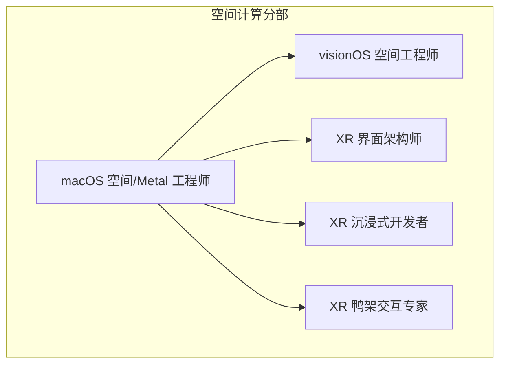
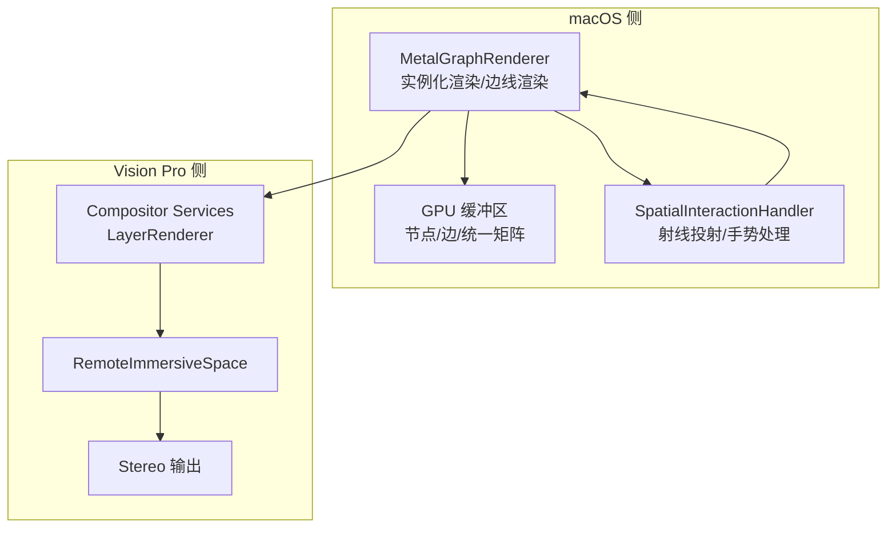
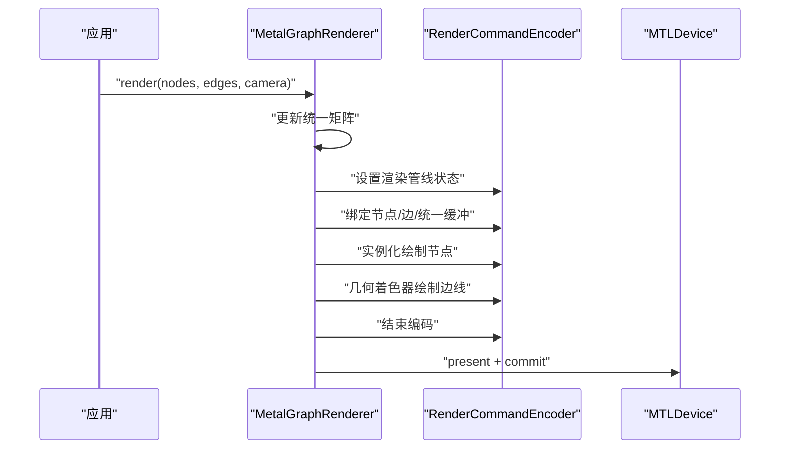
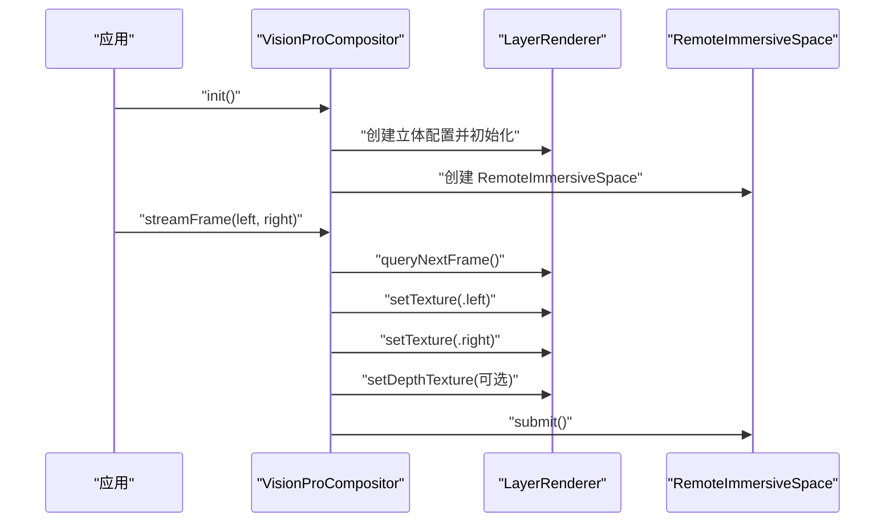
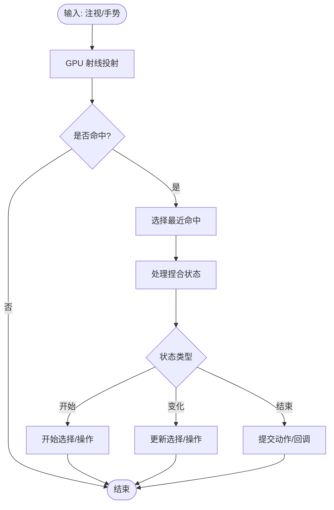
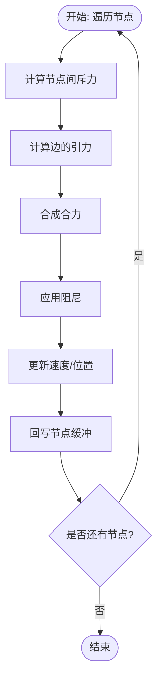
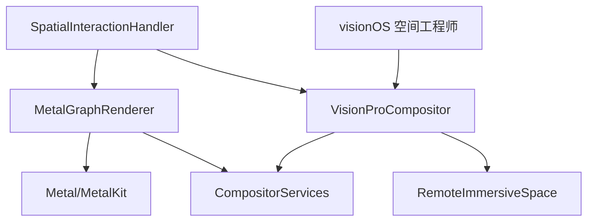

# macOS 空间/Metal 工程师

<cite>
**本文引用的文件**
- [macos-spatial-metal-engineer.md](file://spatial-computing/macos-spatial-metal-engineer.md)
- [visionos-spatial-engineer.md](file://spatial-computing/visionos-spatial-engineer.md)
- [xr-immersive-developer.md](file://spatial-computing/xr-immersive-developer.md)
- [xr-cockpit-interaction-specialist.md](file://spatial-computing/xr-cockpit-interaction-specialist.md)
- [xr-interface-architect.md](file://spatial-computing/xr-interface-architect.md)
- [README.md](file://README.md)
- [nexus-spatial-discovery.md](file://examples/nexus-spatial-discovery.md)
</cite>

## 目录
1. [简介](#简介)
2. [项目结构](#项目结构)
3. [核心组件](#核心组件)
4. [架构总览](#架构总览)
5. [详细组件分析](#详细组件分析)
6. [依赖关系分析](#依赖关系分析)
7. [性能考量](#性能考量)
8. [故障排查指南](#故障排查指南)
9. [结论](#结论)
10. [附录](#附录)

## 简介
本文件面向 macOS 空间/Metal 工程师角色，系统化梳理其在 macOS 与 Vision Pro 上构建高性能 3D 渲染系统与空间计算体验的专业能力。文档聚焦以下关键目标：
- 在 macOS 上实现大规模图数据的高帧率渲染（10k–100k 节点），维持 90fps 帧率
- 使用 Metal 实现实例化渲染、GPU 缓冲区管理、空间布局算法与立体帧流传输
- 集成 Compositor Services 与 RemoteImmersiveSpace，实现 90fps 的沉浸式空间渲染
- 提供 Swift 代码示例路径：MetalGraphRenderer、VisionProCompositor、空间交互系统等
- 总结性能优化策略、内存管理最佳实践与热管理要点

## 项目结构
该仓库为“智能体集合”，macOS 空间/Metal 工程师属于“空间计算”分部，与其他空间计算相关智能体协同工作，共同支撑从界面设计到引擎实现的完整链路。

图表来源
- [README.md:236-247](file://README.md#L236-L247)
- [macos-spatial-metal-engineer.md:1-337](file://spatial-computing/macos-spatial-metal-engineer.md#L1-L337)
- [visionos-spatial-engineer.md:1-54](file://spatial-computing/visionos-spatial-engineer.md#L1-L54)
- [xr-interface-architect.md:1-33](file://spatial-computing/xr-interface-architect.md#L1-L33)
- [xr-immersive-developer.md:1-33](file://spatial-computing/xr-immersive-developer.md#L1-L33)
- [xr-cockpit-interaction-specialist.md:1-33](file://spatial-computing/xr-cockpit-interaction-specialist.md#L1-L33)

章节来源
- [README.md:236-247](file://README.md#L236-L247)

## 核心组件
- Metal 图渲染器（MetalGraphRenderer）：负责实例化节点绘制、边线渲染、统一矩阵更新与命令缓冲提交
- Vision Pro 组合器（VisionProCompositor）：通过 Compositor Services 将左右眼纹理与深度信息提交至 RemoteImmersiveSpace
- 空间交互处理器（SpatialInteractionHandler）：基于 GPU 加速射线投射进行注视选择与手势识别
- 图布局物理（GPU-based force-directed layout）：使用 Metal 计算着色器在 GPU 上并行更新节点位置

章节来源
- [macos-spatial-metal-engineer.md:67-121](file://spatial-computing/macos-spatial-metal-engineer.md#L67-L121)
- [macos-spatial-metal-engineer.md:123-166](file://spatial-computing/macos-spatial-metal-engineer.md#L123-L166)
- [macos-spatial-metal-engineer.md:168-206](file://spatial-computing/macos-spatial-metal-engineer.md#L168-L206)
- [macos-spatial-metal-engineer.md:208-249](file://spatial-computing/macos-spatial-metal-engineer.md#L208-L249)

## 架构总览
下图展示了 macOS 侧渲染管线与 Vision Pro 空间渲染的端到端流程：

图表来源
- [macos-spatial-metal-engineer.md:67-121](file://spatial-computing/macos-spatial-metal-engineer.md#L67-L121)
- [macos-spatial-metal-engineer.md:123-166](file://spatial-computing/macos-spatial-metal-engineer.md#L123-L166)
- [macos-spatial-metal-engineer.md:168-206](file://spatial-computing/macos-spatial-metal-engineer.md#L168-L206)

## 详细组件分析

### Metal 图渲染器（MetalGraphRenderer）
- 职责
  - 管理设备与命令队列
  - 维护渲染/深度模板状态
  - 管理节点/边/统一矩阵的 GPU 缓冲区
  - 执行实例化节点绘制与几何着色器边线绘制
- 关键流程
  - 更新统一矩阵（视图/投影/时间）
  - 设置渲染管线状态与顶点缓冲
  - 执行实例化绘制与边线绘制
  - 结束编码、呈现可绘制对象并提交命令缓冲

图表来源
- [macos-spatial-metal-engineer.md:67-121](file://spatial-computing/macos-spatial-metal-engineer.md#L67-L121)

章节来源
- [macos-spatial-metal-engineer.md:67-121](file://spatial-computing/macos-spatial-metal-engineer.md#L67-L121)

### Vision Pro 组合器（VisionProCompositor）
- 职责
  - 初始化 LayerRenderer（立体模式、颜色/深度格式、专用布局）
  - 创建 RemoteImmersiveSpace（空间标识与包标识）
  - 查询下一帧、设置左右眼纹理与深度纹理、提交帧
- 关键流程
  - 异步初始化组合器与远程沉浸空间
  - 将左右眼渲染纹理与深度纹理写入帧并提交

图表来源
- [macos-spatial-metal-engineer.md:123-166](file://spatial-computing/macos-spatial-metal-engineer.md#L123-L166)

章节来源
- [macos-spatial-metal-engineer.md:123-166](file://spatial-computing/macos-spatial-metal-engineer.md#L123-L166)

### 空间交互处理器（SpatialInteractionHandler）
- 职责
  - 基于视线方向执行 GPU 加速射线投射，返回最近命中
  - 处理捏合手势的状态机（开始/变化/结束），支持选择与操作反馈
- 关键流程
  - 射线投射获取命中列表
  - 选择最近命中并触发委托回调

图表来源
- [macos-spatial-metal-engineer.md:168-206](file://spatial-computing/macos-spatial-metal-engineer.md#L168-L206)

章节来源
- [macos-spatial-metal-engineer.md:168-206](file://spatial-computing/macos-spatial-metal-engineer.md#L168-L206)

### 图布局物理（GPU-based force-directed layout）
- 职责
  - 在 GPU 上并行计算节点受力（节点间斥力、边的引力）
  - 应用阻尼与时间步长更新速度与位置
- 关键流程
  - 遍历节点计算斥力与引力
  - 更新速度与位置并回写缓冲

图表来源
- [macos-spatial-metal-engineer.md:208-249](file://spatial-computing/macos-spatial-metal-engineer.md#L208-L249)

章节来源
- [macos-spatial-metal-engineer.md:208-249](file://spatial-computing/macos-spatial-metal-engineer.md#L208-L249)

### visionOS 空间计算能力概览
- Liquid Glass 设计体系、空间小部件、增强的 WindowGroups、SwiftUI 体积化 API、RealityKit-SwiftUI 集成
- 多窗口架构、空间 UI 模式、性能优化与无障碍集成

章节来源
- [visionos-spatial-engineer.md:1-54](file://spatial-computing/visionos-spatial-engineer.md#L1-L54)

### XR 空间计算与浏览器实现
- WebXR 支持、手部追踪、注视与捏合交互、跨设备兼容性与降级策略

章节来源
- [xr-immersive-developer.md:1-33](file://spatial-computing/xr-immersive-developer.md#L1-L33)

### 空间界面架构与交互设计
- 空间界面设计原则、HUD/浮动菜单/仪表板、多模态输入与舒适度约束

章节来源
- [xr-interface-architect.md:1-33](file://spatial-computing/xr-interface-architect.md#L1-L33)

### 鸭架式交互专家
- 固定视角控制台设计、手控件/推拉杆/节流阀、多输入融合与运动病阈值

章节来源
- [xr-cockpit-interaction-specialist.md:1-33](file://spatial-computing/xr-cockpit-interaction-specialist.md#L1-L33)

## 依赖关系分析
- macOS 侧渲染依赖 Metal/MetalKit 与 CompositorServices
- Vision Pro 侧依赖 RemoteImmersiveSpace 与 LayerRenderer
- 空间交互依赖 GPU 射线投射与手势识别
- 与 visionOS 空间工程师协作，确保 UI 材质与空间布局一致

图表来源
- [macos-spatial-metal-engineer.md:123-166](file://spatial-computing/macos-spatial-metal-engineer.md#L123-L166)
- [visionos-spatial-engineer.md:1-54](file://spatial-computing/visionos-spatial-engineer.md#L1-L54)

章节来源
- [macos-spatial-metal-engineer.md:123-166](file://spatial-computing/macos-spatial-metal-engineer.md#L123-L166)
- [visionos-spatial-engineer.md:1-54](file://spatial-computing/visionos-spatial-engineer.md#L1-L54)

## 性能考量
- 帧率与热管理
  - 立体渲染不低于 90fps；GPU 利用率保持在 80% 以内留出热余量
- 渲染管线优化
  - 实例化渲染、几何着色器边线、早期深度剔除、遮挡剔除、动态 LOD
  - 批量绘制调用（目标每帧 <100 次）
- 内存管理
  - 共享缓冲用于 CPU-GPU 数据传输、私有资源用于频繁更新数据
  - 资源池化与复用、避免循环引用、定期使用 Instruments 分析
- 空间计算体验
  - 遵循人机工程学指南，尊重舒适区域与调节- Accommodation 限制
  - 深度排序正确、手部追踪丢失时优雅降级、支持无障碍功能

章节来源
- [macos-spatial-metal-engineer.md:42-63](file://spatial-computing/macos-spatial-metal-engineer.md#L42-L63)
- [macos-spatial-metal-engineer.md:265-282](file://spatial-computing/macos-spatial-metal-engineer.md#L265-L282)

## 故障排查指南
- 渲染卡顿与掉帧
  - 使用 Metal System Trace 定位瓶颈；检查绘制调用次数、带宽占用与寄存器使用
  - 优先启用早期深度与遮挡剔除，减少像素阶段负载
- 空间交互延迟
  - 射线投射应在 GPU 上完成；减少 CPU-GPU 同步点
  - 降低交互反馈层级，确保主线程无阻塞
- 内存与热管理
  - 控制纹理分辨率与格式（如使用 rgba16Float）；避免一次性分配超大缓冲
  - 监控 GPU 温度与功耗，必要时降低分辨率或关闭非关键特效
- Vision Pro 帧提交问题
  - 确保左右眼纹理与深度纹理同时设置后再提交
  - 检查 RemoteImmersiveSpace 的空间标识与包标识一致性

章节来源
- [macos-spatial-metal-engineer.md:277-282](file://spatial-computing/macos-spatial-metal-engineer.md#L277-L282)
- [macos-spatial-metal-engineer.md:123-166](file://spatial-computing/macos-spatial-metal-engineer.md#L123-L166)

## 结论
macOS 空间/Metal 工程师通过 Metal 实例化渲染、GPU 缓冲区管理与空间布局物理，结合 Compositor Services 与 RemoteImmersiveSpace，实现了在 macOS 与 Vision Pro 上的大规模节点渲染与沉浸式空间体验。遵循严格的性能与热管理标准，配合空间交互与视觉设计的最佳实践，可在保证 90fps 的前提下实现高质量的空间计算应用。

## 附录
- 三段式深度系统与节点图在 3D 中的组织方式（来自示例）
  - 前景层（0.8–1.2m）：活动面板、检查器、模态框
  - 中景层（1.2–2.5m）：节点图、连接线、工作区
  - 背景层（2.5–5.0m）：概览地图、环境状态
  - 节点按执行顺序沿 z 轴排列，分支沿 x/y 轴展开
  - 连接线采用发光管状，按数据类型着色并显示流动粒子

章节来源
- [nexus-spatial-discovery.md:712-744](file://examples/nexus-spatial-discovery.md#L712-L744)