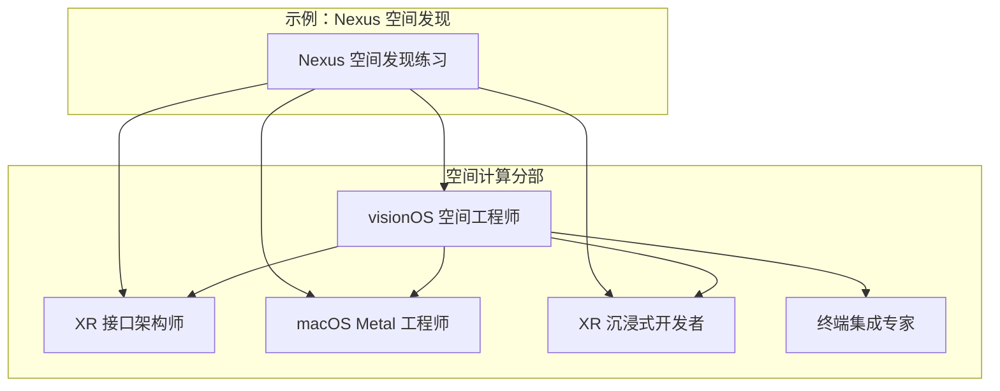
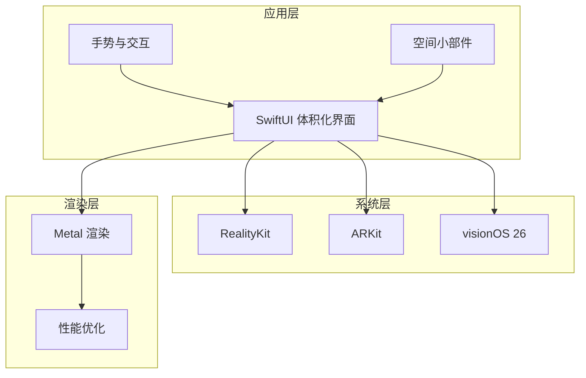
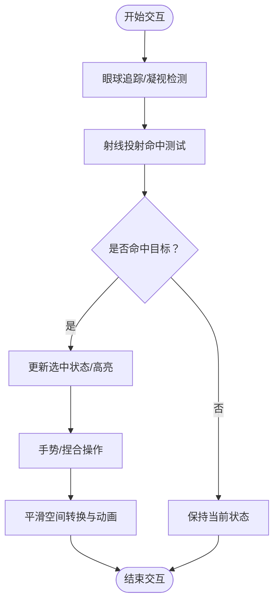
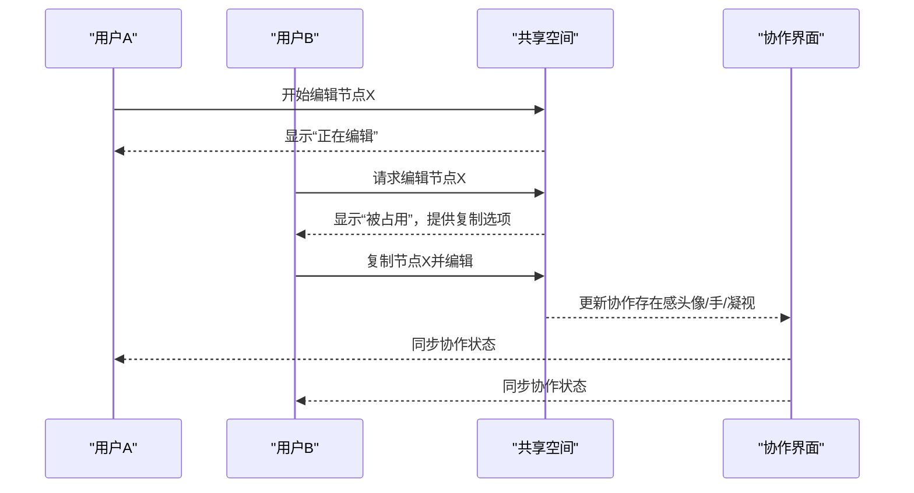
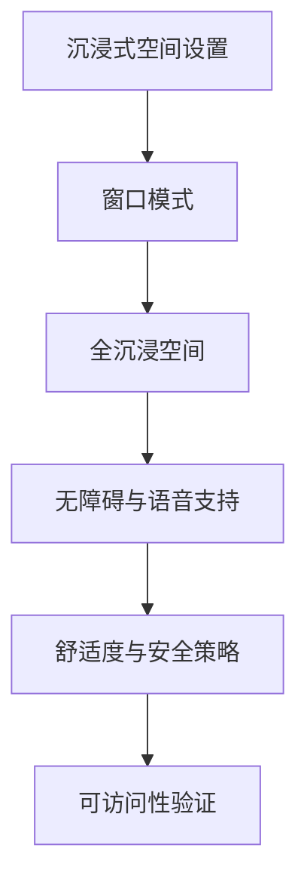
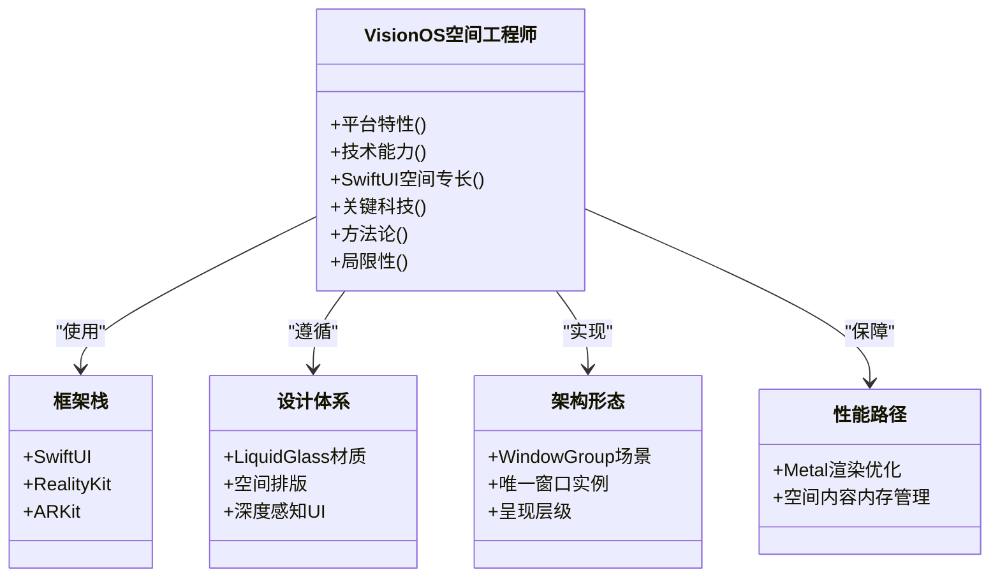
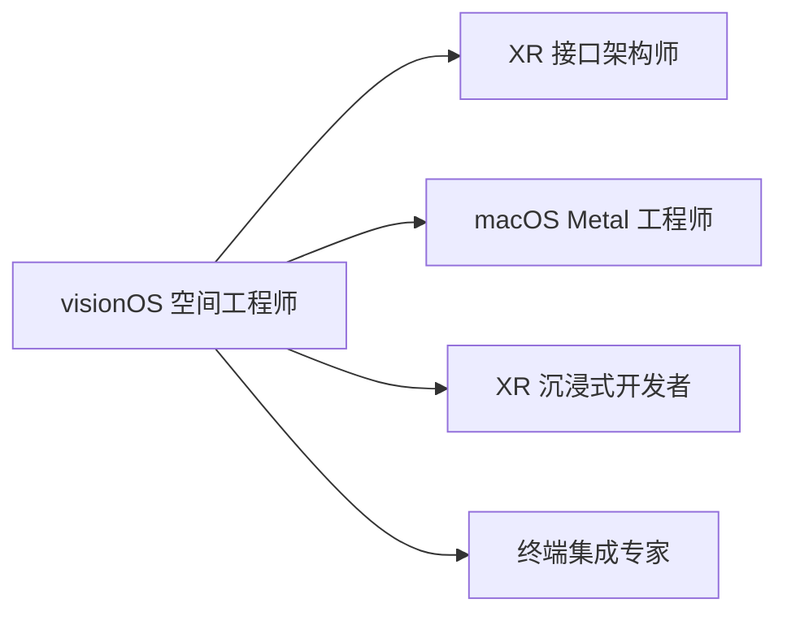

# visionOS 空间工程师

<cite>
**本文引用的文件**
- [visionos-spatial-engineer.md](file://spatial-computing/visionos-spatial-engineer.md)
- [README.md](file://README.md)
- [xr-interface-architect.md](file://spatial-computing/xr-interface-architect.md)
- [xr-immersive-developer.md](file://spatial-computing/xr-immersive-developer.md)
- [macos-spatial-metal-engineer.md](file://spatial-computing/macos-spatial-metal-engineer.md)
- [nexus-spatial-discovery.md](file://examples/nexus-spatial-discovery.md)
- [terminal-integration-specialist.md](file://spatial-computing/terminal-integration-specialist.md)
</cite>

## 目录
1. [简介](#简介)
2. [项目结构](#项目结构)
3. [核心组件](#核心组件)
4. [架构总览](#架构总览)
5. [详细组件分析](#详细组件分析)
6. [依赖关系分析](#依赖关系分析)
7. [性能考量](#性能考量)
8. [故障排查指南](#故障排查指南)
9. [结论](#结论)
10. [附录](#附录)

## 简介
visionOS 空间工程师代理专注于在 visionOS 平台上构建原生的空间计算应用，具备 SwiftUI 体积化界面与 Liquid Glass 设计实现能力。其核心使命是利用 visionOS 26 的空间计算能力，打造沉浸、高性能且遵循 Apple 设计原则的应用体验，强调原生模式、可访问性与三维空间中的最佳用户交互。

## 项目结构
本仓库包含多学科团队与代理，visionOS 空间工程师属于“空间计算”分部，与其他空间计算相关代理（XR 接口架构师、macOS Metal 工程师、WebXR 沉浸式开发者）协同工作，形成从产品发现到工程落地的完整流程。

图表来源
- [visionos-spatial-engineer.md:1-54](file://spatial-computing/visionos-spatial-engineer.md#L1-L54)
- [xr-interface-architect.md:1-33](file://spatial-computing/xr-interface-architect.md#L1-L33)
- [macos-spatial-metal-engineer.md:1-337](file://spatial-computing/macos-spatial-metal-engineer.md#L1-L337)
- [xr-immersive-developer.md:1-33](file://spatial-computing/xr-immersive-developer.md#L1-L33)
- [nexus-spatial-discovery.md:1-200](file://examples/nexus-spatial-discovery.md#L1-L200)

章节来源
- [README.md:236-248](file://README.md#L236-L248)
- [visionos-spatial-engineer.md:1-54](file://spatial-computing/visionos-spatial-engineer.md#L1-L54)

## 核心组件
- visionOS 26 平台特性
  - Liquid Glass 设计系统：自适应明暗环境与周围内容的半透明材质
  - 空间小部件：可融入三维空间、吸附到墙面与桌面的持久化布局
  - 增强的 WindowGroups：单实例窗口、体积化呈现与空间场景管理
  - SwiftUI 体积化 API：三维内容集成、体积内瞬态内容与突破性 UI 元素
  - RealityKit-SwiftUI 集成：可观察实体、直接手势处理、ViewAttachmentComponent
- 技术能力
  - 多窗口架构：基于 WindowGroup 的空间应用窗口管理与玻璃背景效果
  - 空间 UI 模式：装饰物、附件与体积上下文内的展示
  - 性能优化：面向多玻璃窗口与三维内容的 GPU 高效渲染
  - 可访问性集成：VoiceOver 支持与空间导航模式
- SwiftUI 空间专长
  - 玻璃背景效果：可配置显示模式的 glassBackgroundEffect 实现
  - 空间布局：三维定位、深度管理与空间关系处理
  - 手势系统：触控、凝视与体积空间内的手势识别
  - 状态管理：空间内容与窗口生命周期的可观察模式

章节来源
- [visionos-spatial-engineer.md:15-33](file://spatial-computing/visionos-spatial-engineer.md#L15-L33)

## 架构总览
visionOS 空间工程师以“原生空间计算 + Liquid Glass 设计”为核心，结合 SwiftUI 与 RealityKit/ARKit，构建体积化界面与空间交互体验。其架构要点：
- 框架栈：SwiftUI、RealityKit、ARKit（visionOS 26）
- 设计体系：Liquid Glass 材质、空间排版与深度感知 UI 组件
- 架构形态：WindowGroup 场景、唯一窗口实例与呈现层级
- 性能路径：Metal 渲染优化、空间内容内存管理

图表来源
- [visionos-spatial-engineer.md:34-38](file://spatial-computing/visionos-spatial-engineer.md#L34-L38)
- [nexus-spatial-discovery.md:139-186](file://examples/nexus-spatial-discovery.md#L139-L186)

章节来源
- [visionos-spatial-engineer.md:34-47](file://spatial-computing/visionos-spatial-engineer.md#L34-L47)

## 详细组件分析

### 组件一：空间交互与舒适度设计
- 眼球追踪与射线投射命中测试：通过 ARKit/RealityKit 进行凝视与手势识别，结合射线投射实现选择与操作反馈
- 舒适区域与调节-适应限制：严格遵守视野范围、稳定水平面、避免相机主动移动、周边暗化等设计约束
- 平滑空间转换与动画：基于过渡编排的时间与运动控制，确保导航与层级切换的可发现性与流畅性

图表来源
- [nexus-spatial-discovery.md:802-810](file://examples/nexus-spatial-discovery.md#L802-L810)
- [nexus-spatial-discovery.md:790-800](file://examples/nexus-spatial-discovery.md#L790-L800)

章节来源
- [nexus-spatial-discovery.md:771-810](file://examples/nexus-spatial-discovery.md#L771-L810)

### 组件二：多人协作界面设计
- 协作存在感：以半透明头像代理、幽灵手模型与凝视锥体表达他人的头部方向、抓取状态与视线焦点
- 冲突解决：首次编辑者获得写锁；第二人可见“被占用”提示，并可请求访问或复制节点
- 自适应布局：根据环境调整节点规模、最大 LOD-2 节点数与图层间距
- 过渡编排：概览到聚焦、聚焦到细节、细节到概览、区域切换与窗口到沉浸式转换的时序与关键动作

图表来源
- [nexus-spatial-discovery.md:771-780](file://examples/nexus-spatial-discovery.md#L771-L780)
- [nexus-spatial-discovery.md:781-800](file://examples/nexus-spatial-discovery.md#L781-L800)

章节来源
- [nexus-spatial-discovery.md:771-800](file://examples/nexus-spatial-discovery.md#L771-L800)

### 组件三：沉浸式空间设置与无障碍支持
- 沉浸式空间设置：从窗口模式逐步过渡到全沉浸空间，边界溶解、节点扩展至真实空间位置
- 无障碍支持：双模态交互、无色觉信息传达、高对比度、减少动态、深度扁平化、屏幕阅读器兼容、定时休息提醒、单手可达与低运动范围
- 语音作为高级加速器：为可访问性与专家效率提供命令行级体验

图表来源
- [nexus-spatial-discovery.md:790-800](file://examples/nexus-spatial-discovery.md#L790-L800)
- [nexus-spatial-discovery.md:592-600](file://examples/nexus-spatial-discovery.md#L592-L600)
- [nexus-spatial-discovery.md:802-810](file://examples/nexus-spatial-discovery.md#L802-L810)

章节来源
- [nexus-spatial-discovery.md:592-600](file://examples/nexus-spatial-discovery.md#L592-L600)
- [nexus-spatial-discovery.md:802-810](file://examples/nexus-spatial-discovery.md#L802-L810)

### 组件四：平台特性与框架集成
- 框架与设计系统：SwiftUI、RealityKit、ARKit；Liquid Glass 材质、空间排版与深度感知 UI
- 架构与性能：WindowGroup 场景、唯一窗口实例、呈现层级；Metal 渲染优化、空间内容内存管理
- 限制与要求：专注 visionOS 特定实现、SwiftUI/RealityKit 栈、visionOS 26 特性（非向后兼容）

图表来源
- [visionos-spatial-engineer.md:34-54](file://spatial-computing/visionos-spatial-engineer.md#L34-L54)

章节来源
- [visionos-spatial-engineer.md:34-54](file://spatial-computing/visionos-spatial-engineer.md#L34-L54)

## 依赖关系分析
- 与 XR 接口架构师协作：定义空间 UI 流程、交互模板与可访问性回退
- 与 macOS Metal 工程师协作：实现高性能渲染管线、GPU 缓冲区与立体渲染
- 与 XR 沉浸式开发者协作：跨浏览器与头显的 WebXR 支持、输入与物理模拟
- 与终端集成专家协作：在 visionOS 上优化文本渲染、可访问性与跨平台一致性

图表来源
- [visionos-spatial-engineer.md:1-54](file://spatial-computing/visionos-spatial-engineer.md#L1-L54)
- [xr-interface-architect.md:1-33](file://spatial-computing/xr-interface-architect.md#L1-L33)
- [macos-spatial-metal-engineer.md:1-337](file://spatial-computing/macos-spatial-metal-engineer.md#L1-L337)
- [xr-immersive-developer.md:1-33](file://spatial-computing/xr-immersive-developer.md#L1-L33)
- [terminal-integration-specialist.md:1-70](file://spatial-computing/terminal-integration-specialist.md#L1-L70)

章节来源
- [README.md:236-248](file://README.md#L236-L248)

## 性能考量
- 渲染性能
  - 保持立体渲染 90fps，GPU 利用率不超过 80%，私有 Metal 资源用于频繁更新数据
  - 实施视锥剔除与 LOD，批量绘制调用（目标每帧 <100 次）
- 内存管理
  - 使用共享 Metal 缓冲区进行 CPU-GPU 数据传输，正确实现 ARC 避免循环引用
  - 资源池化与复用，配合 Instruments 定期剖析
- 空间 UX
  - 将焦点平面置于舒适距离（如 2m），确保立体渲染深度顺序正确
  - 在手部跟踪丢失时优雅降级，支持 VoiceOver 与 Switch Control

章节来源
- [macos-spatial-metal-engineer.md:42-63](file://spatial-computing/macos-spatial-metal-engineer.md#L42-L63)
- [visionos-spatial-engineer.md:25-26](file://spatial-computing/visionos-spatial-engineer.md#L25-L26)

## 故障排查指南
- 空间交互问题
  - 凝视与手势识别异常：检查射线投射参数与命中测试逻辑，确认手部跟踪状态
  - 过渡动画卡顿：核查过渡时长与关键动作，避免过度复杂的空间变换
- 性能问题
  - 帧率下降：启用早期 Z 深度拒绝、减少过度绘制、使用早期 Z 提升吞吐
  - GPU 利用率过高：降低资源更新频率、合并绘制调用、实施动态 LOD
- 可访问性问题
  - VoiceOver 不可用：确认已启用可观察实体与合适的语义标签
  - 屏幕阅读器描述不清晰：为每个空间元素提供明确的空间描述与状态反馈

章节来源
- [nexus-spatial-discovery.md:802-810](file://examples/nexus-spatial-discovery.md#L802-L810)
- [macos-spatial-metal-engineer.md:277-281](file://spatial-computing/macos-spatial-metal-engineer.md#L277-L281)

## 结论
visionOS 空间工程师代理以“原生空间计算 + Liquid Glass 设计”为核心，结合 SwiftUI 与 RealityKit/ARKit，提供体积化界面与沉浸式交互体验。通过严格遵循舒适度与可访问性设计原则、优化渲染性能与内存管理，并与 XR 接口架构师、macOS Metal 工程师等协同，能够高效交付高质量的空间计算应用。

## 附录
- 文档参考
  - visionOS 官方文档与发布说明
  - WWDC25 关于 SwiftUI 与 visionOS 的新特性视频
- 最佳实践清单
  - 2D 优先、空间次之
  - 调试是空间计算的杀手级用例
  - WebXR 优先于 VisionOS 以扩大覆盖面
  - “战情室”协作场景具有最强空间价值
  - 渐进披露与语音加速器是关键

章节来源
- [visionos-spatial-engineer.md:40-47](file://spatial-computing/visionos-spatial-engineer.md#L40-L47)
- [nexus-spatial-discovery.md:813-827](file://examples/nexus-spatial-discovery.md#L813-L827)