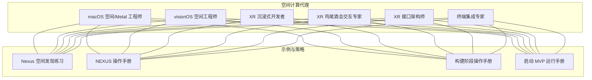
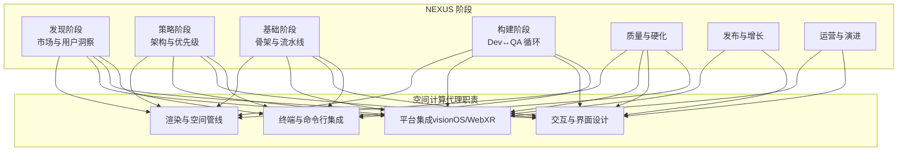
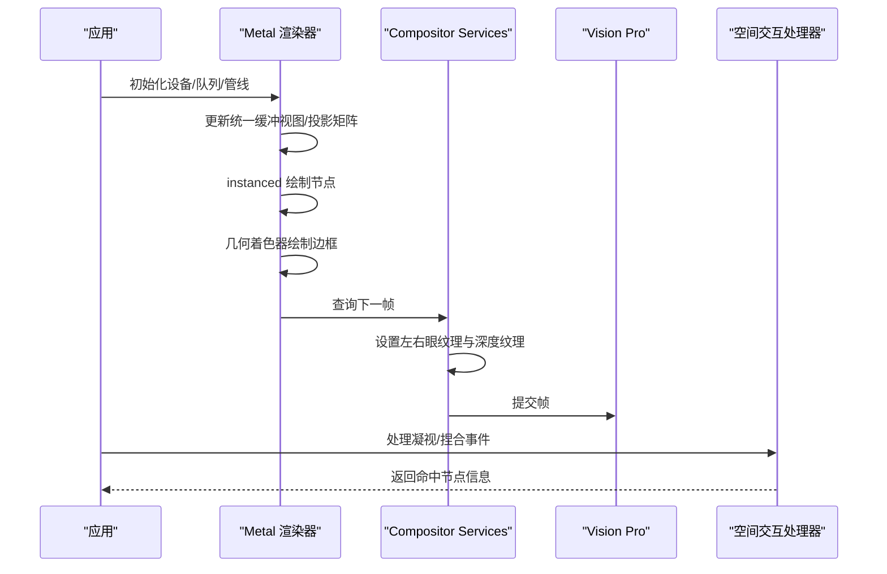
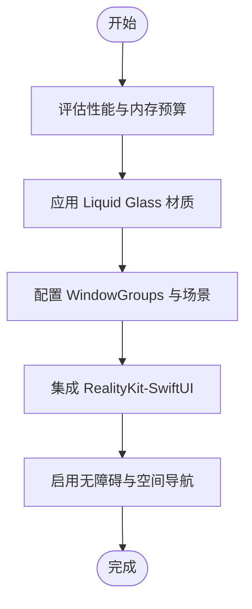
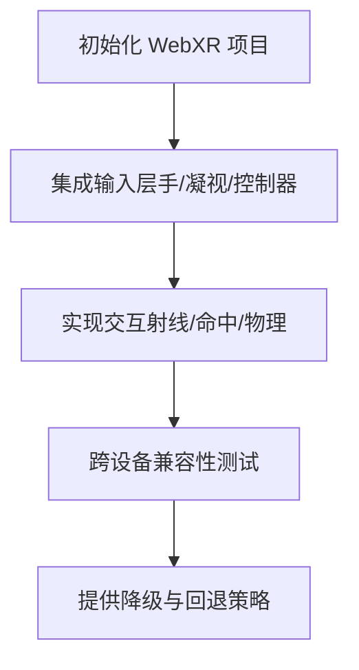
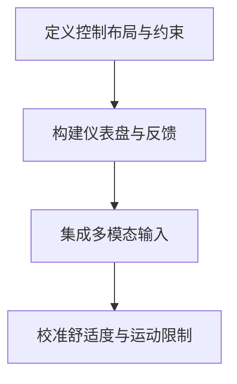
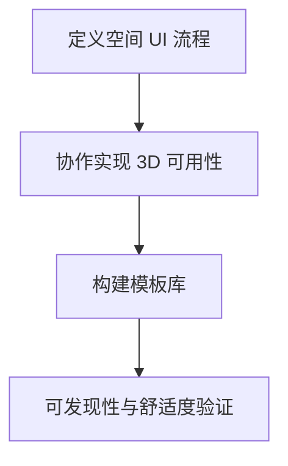
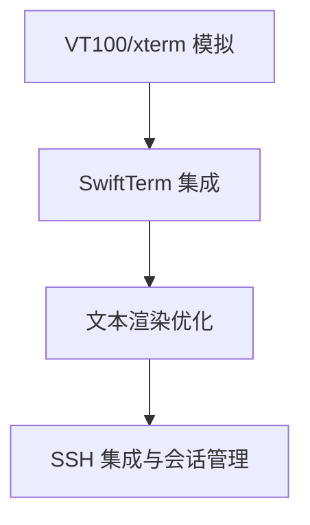
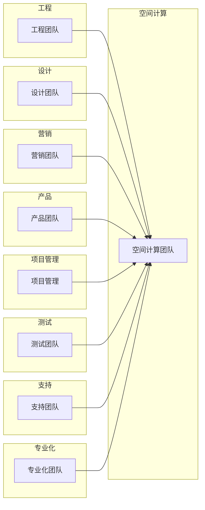

# 空间计算代理

<cite>
**本文档引用的文件**
- [macOS 空间/Metal 工程师](file://spatial-computing/macos-spatial-metal-engineer.md)
- [visionOS 空间工程师](file://spatial-computing/visionos-spatial-engineer.md)
- [XR 沉浸式开发者](file://spatial-computing/xr-immersive-developer.md)
- [XR 鸡尾酒会交互专家](file://spatial-computing/xr-cockpit-interaction-specialist.md)
- [XR 接口架构师](file://spatial-computing/xr-interface-architect.md)
- [终端集成专家](file://spatial-computing/terminal-integration-specialist.md)
- [Nexus 空间发现练习](file://examples/nexus-spatial-discovery.md)
- [NEXUS 操作手册](file://strategy/nexus-strategy.md)
- [构建阶段操作手册](file://strategy/playbooks/phase-3-build.md)
- [启动 MVP 运行手册](file://strategy/runbooks/scenario-startup-mvp.md)
- [项目总览](file://README.md)
</cite>

## 目录
1. [简介](#简介)
2. [项目结构](#项目结构)
3. [核心组件](#核心组件)
4. [架构总览](#架构总览)
5. [详细组件分析](#详细组件分析)
6. [依赖关系分析](#依赖关系分析)
7. [性能考量](#性能考量)
8. [故障排查指南](#故障排查指南)
9. [结论](#结论)
10. [附录](#附录)

## 简介
本文件系统化梳理空间计算代理在 AR/VR/XR 技术栈中的专业能力，覆盖以下角色：
- macOS 空间/Metal 工程师：Swift + Metal 高性能渲染管线与 Vision Pro 空间计算集成
- visionOS 空间工程师：原生 visionOS 空间体验与 Liquid Glass 设计体系
- XR 沉浸式开发者：WebXR 浏览器端沉浸式应用与多平台兼容
- XR 鸡尾酒会交互专家：多人协作界面与固定视角控制台设计
- XR 接口架构师：空间交互设计与可用性原则
- 终端集成专家：SwiftTerm 终端嵌入与文本渲染优化

这些代理共同支撑从概念验证到产品落地的完整流程，并与 NEXUS 多智能体编排体系协同，确保技术架构、用户体验与商业目标的一致性。

## 项目结构
空间计算代理位于 `spatial-computing/` 目录下，每个代理以独立 Markdown 文件呈现其身份、使命、规则、交付物与工作流。同时，示例与策略文档提供了跨代理协作与项目执行的上下文。

图表来源
- [macOS 空间/Metal 工程师](file://spatial-computing/macos-spatial-metal-engineer.md)
- [visionOS 空间工程师](file://spatial-computing/visionos-spatial-engineer.md)
- [XR 沉浸式开发者](file://spatial-computing/xr-immersive-developer.md)
- [XR 鸡尾酒会交互专家](file://spatial-computing/xr-cockpit-interaction-specialist.md)
- [XR 接口架构师](file://spatial-computing/xr-interface-architect.md)
- [终端集成专家](file://spatial-computing/terminal-integration-specialist.md)
- [Nexus 空间发现练习](file://examples/nexus-spatial-discovery.md)
- [NEXUS 操作手册](file://strategy/nexus-strategy.md)
- [构建阶段操作手册](file://strategy/playbooks/phase-3-build.md)
- [启动 MVP 运行手册](file://strategy/runbooks/scenario-startup-mvp.md)

章节来源
- [项目总览](file://README.md)
- [Nexus 空间发现练习](file://examples/nexus-spatial-discovery.md)

## 核心组件
- macOS 空间/Metal 工程师：负责高性能 3D 渲染管线（instanced rendering、GPU 物理布局、几何着色器）、Stereo 帧流式传输至 Vision Pro、空间交互（gaze、手势）与性能优化（帧率、内存、热管理）。
- visionOS 空间工程师：专注 visionOS 平台特性（Liquid Glass 材质、空间小部件、WindowGroups、SwiftUI Volumetric API、RealityKit-SwiftUI 集成），强调原生模式与性能优化。
- XR 沉浸式开发者：WebXR 全栈工程师，支持手部追踪、捏合、凝视与控制器输入，实现跨设备兼容与性能优化。
- XR 鸡尾酒会交互专家：固定视角控制台设计，结合真实感与用户舒适度，提供多模态输入（手势、语音、凝视、物理道具）。
- XR 接口架构师：空间 UI/UX 设计，最小化晕动症、增强沉浸感，支持直接触摸、凝视+捏合、控制器与手势输入模型。
- 终端集成专家：SwiftTerm 集成、VT100/xterm 标准、字符编码、滚动缓冲、SSH 集成、无障碍与跨平台渲染优化。

章节来源
- [macOS 空间/Metal 工程师](file://spatial-computing/macos-spatial-metal-engineer.md)
- [visionOS 空间工程师](file://spatial-computing/visionos-spatial-engineer.md)
- [XR 沉浸式开发者](file://spatial-computing/xr-immersive-developer.md)
- [XR 鸡尾酒会交互专家](file://spatial-computing/xr-cockpit-interaction-specialist.md)
- [XR 接口架构师](file://spatial-computing/xr-interface-architect.md)
- [终端集成专家](file://spatial-computing/terminal-integration-specialist.md)

## 架构总览
空间计算代理在 NEXUS 编排体系中承担“空间体验与系统集成”的关键职责，贯穿 Discovery、Strategy、Foundation、Build、Hardening、Launch、Operate 各阶段。

图表来源
- [NEXUS 操作手册](file://strategy/nexus-strategy.md)
- [构建阶段操作手册](file://strategy/playbooks/phase-3-build.md)
- [启动 MVP 运行手册](file://strategy/runbooks/scenario-startup-mvp.md)

## 详细组件分析

### macOS 空间/Metal 工程师
- 技术专长
  - Metal 渲染管线：instanced drawing、几何着色器、三重缓冲、GPU 物理布局（force-directed）
  - Vision Pro Compositor Services：stereo 输出、深度纹理、RemoteImmersiveSpace
  - 空间交互：raycast hit testing、gaze + pinch、平滑过渡与动画
  - 性能与内存：帧率目标、GPU 利用率上限、资源池化、内存预算
- 工作流程
  - 步骤 1：设置 Metal 管线与 Xcode 工程
  - 步骤 2：构建渲染系统（instanced node、抗锯齿边框、三重缓冲、视锥剔除）
  - 步骤 3：集成 Vision Pro（Compositor Services、RemoteImmersiveSpace、手部追踪）
  - 步骤 4：性能优化（Metal System Trace、变量率着色、动态 LOD、时间超采样）
- 成功指标
  - 25k 节点下维持 90fps（立体）
  - 注视选择延迟 <50ms
  - 内存使用 <1GB
  - 图形更新无丢帧
  - 空间交互即时自然
  - 用户长时间使用不疲劳

图表来源
- [macOS 空间/Metal 工程师](file://spatial-computing/macos-spatial-metal-engineer.md)

章节来源
- [macOS 空间/Metal 工程师](file://spatial-computing/macos-spatial-metal-engineer.md)

### visionOS 空间工程师
- 技术专长
  - visionOS 26 平台特性：Liquid Glass 材质、空间小部件、WindowGroups、SwiftUI Volumetric API、RealityKit-SwiftUI 集成
  - 多窗口架构：玻璃背景效果、空间场景管理
  - 性能优化：多玻璃窗口与 3D 内容的 GPU 效率
  - 无障碍：VoiceOver 支持与空间导航
- 关键技术
  - 框架：SwiftUI、RealityKit、ARKit（visionOS 26）
  - 设计体系：Liquid Glass 材料、空间排版、深度感知 UI 组件
  - 架构：WindowGroup 场景、唯一窗口实例、展示层级
  - 性能：Metal 渲染优化、空间内容内存管理

图表来源
- [visionOS 空间工程师](file://spatial-computing/visionos-spatial-engineer.md)

章节来源
- [visionOS 空间工程师](file://spatial-computing/visionos-spatial-engineer.md)

### XR 沉浸式开发者
- 技术专长
  - WebXR 全栈：A-Frame、Three.js、Babylon.js、WebXR Device APIs
  - 输入系统：手部追踪、捏合、凝视、控制器
  - 交互：射线投射、命中测试、实时物理
  - 兼容性：Meta Quest、Vision Pro、HoloLens、移动 AR
- 工作流程
  - 构建 WebXR 项目（性能与可访问性最佳实践）
  - 实现沉浸式 3D UI 与交互表面
  - 调试空间输入问题（浏览器与运行时环境）
  - 提供降级策略与优雅退化

图表来源
- [XR 沉浸式开发者](file://spatial-computing/xr-immersive-developer.md)

章节来源
- [XR 沉浸式开发者](file://spatial-computing/xr-immersive-developer.md)

### XR 鸡尾酒会交互专家
- 技术专长
  - 固定视角控制台：手交互摇杆、操纵杆、节流阀
  - 仪表盘 UI：开关、旋钮、仪表与动画反馈
  - 多模态输入：手势、语音、凝视、物理道具
  - 舒适度：锚定用户视角、减少眩晕阈值
- 工作流程
  - 设计手交互控制（3D 模型与输入约束）
  - 构建仪表盘 UI（切换、开关、仪表）
  - 多输入 UX（手势/语音/凝视/物理道具）
  - 降低眩晕：固定视角、自然的人机头流动线

图表来源
- [XR 鸡尾酒会交互专家](file://spatial-computing/xr-cockpit-interaction-specialist.md)

章节来源
- [XR 鸡尾酒会交互专家](file://spatial-computing/xr-cockpit-interaction-specialist.md)

### XR 接口架构师
- 技术专长
  - 空间 UI/UX：HUD、漂浮菜单、面板、交互区域
  - 输入模型：直接触摸、凝视+捏合、控制器、手势
  - 舒适度：基于人体工学的 UI 放置与运动约束
  - 可发现性：多模态输入与可访问性回退
- 工作流程
  - 定义空间 UI 流程
  - 与开发者协作确保 3D 上的可用性
  - 构建模板（驾驶舱/仪表板/可穿戴界面）
  - 可靠性实验（舒适度与学习性）

图表来源
- [XR 接口架构师](file://spatial-computing/xr-interface-architect.md)

章节来源
- [XR 接口架构师](file://spatial-computing/xr-interface-architect.md)

### 终端集成专家
- 技术专长
  - VT100/xterm 标准：ANSI 转义序列、光标控制、终端状态管理
  - 字符编码：UTF-8、Unicode、国际字符与表情渲染
  - SwiftTerm 集成：SwiftUI 嵌入、输入处理、选择复制、主题定制
  - 性能优化：Core Graphics 文本渲染、滚动缓冲、后台线程 I/O、电池效率
  - SSH 集成：连接桥接、连接状态、错误处理、会话管理
- 工作流程
  - 终端模拟（VT100/xterm、编码、滚动缓冲）
  - SwiftTerm 集成（输入/选择/主题）
  - 性能优化（渲染、内存、线程、省电）
  - SSH 集成（I/O 桥接、连接/断开/重连、错误显示、会话管理）

图表来源
- [终端集成专家](file://spatial-computing/terminal-integration-specialist.md)

章节来源
- [终端集成专家](file://spatial-computing/terminal-integration-specialist.md)

## 依赖关系分析
空间计算代理在 NEXUS 中与其他代理存在明确的产出与消费关系，形成跨职能协作闭环。

图表来源
- [NEXUS 操作手册](file://strategy/nexus-strategy.md)

章节来源
- [NEXUS 操作手册](file://strategy/nexus-strategy.md)

## 性能考量
- 渲染性能
  - 帧率目标：90fps（立体）
  - GPU 利用率：保持在 80% 以内留有热余量
  - draw call 批处理：每帧 <100 次
  - 视锥剔除与 LOD：大规模图数据的可见性与细节控制
- 交互响应
  - 注视选择延迟：<50ms
  - 手势识别鲁棒性：在不同设备上保持一致
- 内存与能耗
  - 内存预算：单应用 <1GB
  - 省电优化：空闲周期优化、渲染循环节拍
- 可靠性与可维护性
  - 代码审查与证据驱动的质量门禁
  - 性能基准与回归测试
  - 多轮迭代与风险控制

## 故障排查指南
- 渲染卡顿
  - 使用 Metal System Trace 分析瓶颈
  - 检查 draw call 数量与 GPU 占用
  - 应用视锥剔除与 LOD
- 空间交互延迟
  - 校准手部追踪与凝视传感器
  - 降低渲染负载或提升帧率
- 内存泄漏
  - 检查资源池化与 ARC 使用
  - 定期使用 Instruments 分析
- WebXR 兼容性
  - 浏览器支持矩阵与自动化测试
  - 提供降级路径与回退行为
- 终端渲染卡顿
  - Core Graphics 优化与滚动缓冲
  - 后台线程处理 I/O，避免阻塞 UI

章节来源
- [macOS 空间/Metal 工程师](file://spatial-computing/macos-spatial-metal-engineer.md)
- [XR 沉浸式开发者](file://spatial-computing/xr-immersive-developer.md)
- [终端集成专家](file://spatial-computing/terminal-integration-specialist.md)

## 结论
空间计算代理通过专业化的技术栈与严谨的工作流程，为 AR/VR/XR 产品提供从渲染管线、平台集成、交互设计到终端工具的全链路支撑。在 NEXUS 编排体系下，这些代理能够并行协作、快速迭代，并以证据驱动的方式确保质量与交付节奏。建议在项目早期即引入空间计算代理，以“2D 首先、空间其次”的策略，逐步将空间能力融入产品，最终实现沉浸式体验与业务价值的统一。

## 附录
- 实际项目案例与最佳实践
  - Nexus Spatial：以 WebXR 作为分发入口，逐步扩展到 VisionOS 的空间命令中心，强调调试与协作的“空间叠加”优势
  - 多代理协同：在 Discovery 阶段由趋势研究、用户研究、UX 研究、法律合规等代理共同验证机会；在 Build 阶段由空间计算代理与工程、设计、测试代理并行推进
- 跨平台集成方案
  - WebXR 作为跨平台入口，统一浏览器与头显体验
  - visionOS 原生应用作为高保真体验与生态整合
  - macOS Metal 渲染管线作为桌面与伴生应用的高性能基座
  - 终端集成专家提供统一的命令行与 SSH 工具链

章节来源
- [Nexus 空间发现练习](file://examples/nexus-spatial-discovery.md)
- [NEXUS 操作手册](file://strategy/nexus-strategy.md)
- [构建阶段操作手册](file://strategy/playbooks/phase-3-build.md)
- [启动 MVP 运行手册](file://strategy/runbooks/scenario-startup-mvp.md)