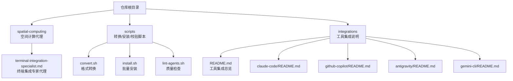
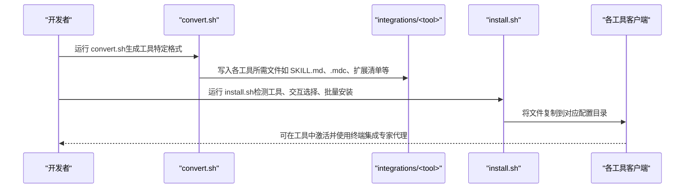
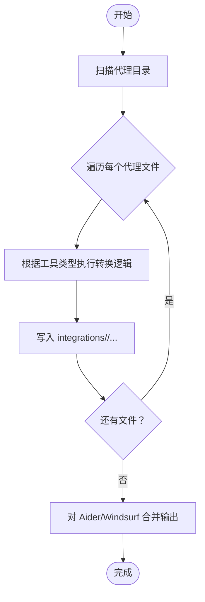
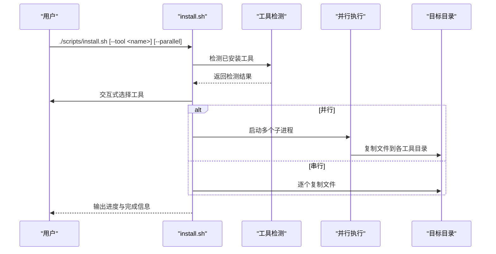
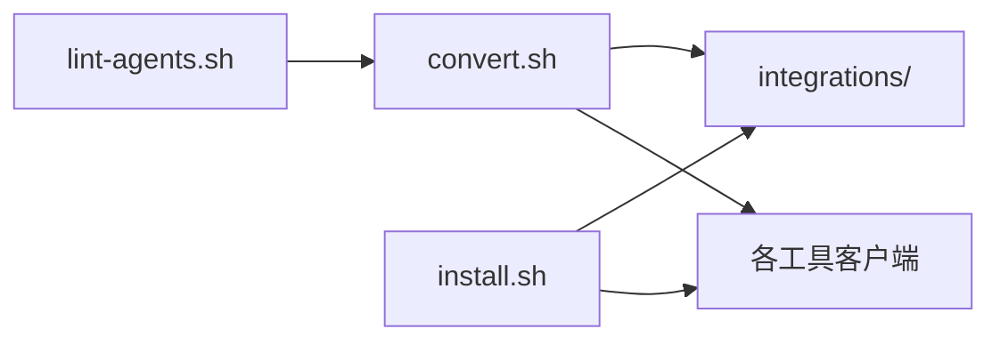

# 终端集成专家

<cite>
**本文引用的文件**
- [README.md](file://README.md)
- [terminal-integration-specialist.md](file://spatial-computing/terminal-integration-specialist.md)
- [install.sh](file://scripts/install.sh)
- [convert.sh](file://scripts/convert.sh)
- [lint-agents.sh](file://scripts/lint-agents.sh)
- [integrations/README.md](file://integrations/README.md)
- [integrations/claude-code/README.md](file://integrations/claude-code/README.md)
- [integrations/github-copilot/README.md](file://integrations/github-copilot/README.md)
- [integrations/antigravity/README.md](file://integrations/antigravity/README.md)
- [integrations/gemini-cli/README.md](file://integrations/gemini-cli/README.md)
</cite>

## 目录
1. [简介](#简介)
2. [项目结构](#项目结构)
3. [核心组件](#核心组件)
4. [架构总览](#架构总览)
5. [详细组件分析](#详细组件分析)
6. [依赖关系分析](#依赖关系分析)
7. [性能考量](#性能考量)
8. [故障排查指南](#故障排查指南)
9. [结论](#结论)
10. [附录](#附录)

## 简介
本文件面向“终端集成专家代理”的跨平台终端工具链优化与集成能力，系统化阐述如何将空间计算能力与传统终端环境无缝衔接，覆盖命令行接口设计、批处理脚本、自动化工作流、跨平台兼容性处理、统一接口抽象、最佳实践（性能、错误处理、日志与调试）、以及终端与图形界面的协同模式。文档以仓库中的脚本与集成规范为依据，结合空间计算领域的代理角色，给出可落地的工程化方案。

## 项目结构
本仓库围绕“多工具集成”提供统一的转换与安装流程，终端集成专家代理作为空间计算领域的一个专业化角色，与其他代理共享相同的前端格式与工具链。关键路径如下：
- 核心代理文档位于各业务域目录（如 spatial-computing），终端集成专家代理位于该目录下。
- 工具链脚本位于 scripts/，包含 convert.sh（格式转换）、install.sh（批量安装）、lint-agents.sh（质量检查）。
- integrations/ 提供各工具的集成说明与安装指引。

图表来源
- [README.md](file://README.md)
- [terminal-integration-specialist.md](file://spatial-computing/terminal-integration-specialist.md)
- [install.sh](file://scripts/install.sh)
- [convert.sh](file://scripts/convert.sh)
- [lint-agents.sh](file://scripts/lint-agents.sh)
- [integrations/README.md](file://integrations/README.md)
- [integrations/claude-code/README.md](file://integrations/claude-code/README.md)
- [integrations/github-copilot/README.md](file://integrations/github-copilot/README.md)
- [integrations/antigravity/README.md](file://integrations/antigravity/README.md)
- [integrations/gemini-cli/README.md](file://integrations/gemini-cli/README.md)

章节来源
- [README.md](file://README.md)
- [terminal-integration-specialist.md](file://spatial-computing/terminal-integration-specialist.md)
- [install.sh](file://scripts/install.sh)
- [convert.sh](file://scripts/convert.sh)
- [lint-agents.sh](file://scripts/lint-agents.sh)
- [integrations/README.md](file://integrations/README.md)

## 核心组件
- 终端集成专家代理：专注于终端仿真、文本渲染优化与 SwiftTerm 集成，强调 VT100/xterm 标准、字符编码、滚动缓冲、输入处理、主题定制、性能优化与 SSH 集成模式。
- 工具链脚本：
  - convert.sh：将 Markdown 代理转换为各工具所需的格式（如 Antigravity 的 SKILL.md、Gemini CLI 扩展、Cursor 的 .mdc 规则等）。
  - install.sh：自动检测已安装工具，交互式选择目标工具，批量安装到对应配置目录；支持并行作业与进度输出。
  - lint-agents.sh：对代理 Markdown 进行质量检查（必需 frontmatter 字段、推荐章节、内容长度等）。
- 工具集成说明：各工具的安装与使用指引，明确安装位置、激活方式与注意事项。

章节来源
- [terminal-integration-specialist.md](file://spatial-computing/terminal-integration-specialist.md)
- [convert.sh](file://scripts/convert.sh)
- [install.sh](file://scripts/install.sh)
- [lint-agents.sh](file://scripts/lint-agents.sh)
- [integrations/README.md](file://integrations/README.md)

## 架构总览
下图展示了从代理源文件到多工具可用格式的转换与安装流程，以及终端集成专家代理在空间计算领域的定位与协作方式。

图表来源
- [convert.sh](file://scripts/convert.sh)
- [install.sh](file://scripts/install.sh)
- [integrations/README.md](file://integrations/README.md)

## 详细组件分析

### 终端集成专家代理（空间计算视角）
- 专业能力
  - 终端仿真：支持 VT100/xterm 标准、ANSI 转义序列、光标控制、滚动缓冲与搜索。
  - SwiftTerm 集成：SwiftUI 嵌入、键盘输入处理、选择复制、剪贴板与无障碍支持、字体与主题定制。
  - 性能优化：Core Graphics 文本渲染、内存管理、后台线程处理、节电优化。
  - SSH 集成：SSH 流桥接、连接状态管理、错误显示、会话管理与持久化。
- 技术要点
  - SwiftTerm API 深度使用与定制。
  - 终端协议规范与边缘用例处理。
  - 无障碍支持（VoiceOver、动态字体）。
  - Apple 平台（iOS、macOS、visionOS）渲染差异与优化。
- 适用场景
  - 在空间计算应用中提供高性能、低延迟的终端体验。
  - 通过 SSH 连接远程资源，统一本地与远端开发工作流。
  - 在 SwiftUI 应用中嵌入终端视图，实现“图形界面 + 终端工具链”的协同。

章节来源
- [terminal-integration-specialist.md](file://spatial-computing/terminal-integration-specialist.md)

### 转换器（convert.sh）
- 功能
  - 将标准 Markdown 代理转换为各工具特定格式：
    - Antigravity：每个代理生成独立 SKILL.md，并添加固定 frontmatter 字段。
    - Gemini CLI：生成扩展清单与技能目录结构。
    - OpenCode/Cursor：生成 .md 或 .mdc 规则文件。
    - OpenClaw：拆分 persona 与 operations 到 SOUL.md 与 AGENTS.md，并生成 IDENTITY.md。
    - Qwen/Kimi：生成 SubAgent 文件或 YAML + system.md。
    - Aider/Windsurf：汇总为单文件（CONVENTIONS.md 或 .windsurfrules）。
  - 支持并行转换，按工具分组执行，缓冲输出保证顺序一致性。
- 关键流程
  - 解析 YAML frontmatter，提取 name/description/color 等字段。
  - 生成 slug 并写入目标目录。
  - 对 OpenClaw 进行内容分桶（按标题关键字分类到 SOUL/AGENTS）。
  - 对 Aider/Windsurf 使用临时文件累积后一次性写出。

图表来源
- [convert.sh](file://scripts/convert.sh)

章节来源
- [convert.sh](file://scripts/convert.sh)

### 安装器（install.sh）
- 功能
  - 自动检测已安装工具（如 ~/.claude、~/.github、~/.copilot、~/.gemini、~/.qwen 等）。
  - 交互式选择要安装的工具，支持全选/清空/仅检测到的快捷键。
  - 批量安装到对应配置目录，支持并行作业与进度条输出。
  - 针对项目级工具（如 OpenCode、Cursor、Aider、Windsurf）提示在项目根目录运行。
- 关键流程
  - 检查 integrations/ 是否存在（需先 convert.sh）。
  - 自动检测工具是否存在。
  - 交互式 UI 展示工具列表与勾选项。
  - 并行安装时通过子进程隔离输出，避免乱序。
  - 安装完成后输出完成框与提示。

图表来源
- [install.sh](file://scripts/install.sh)

章节来源
- [install.sh](file://scripts/install.sh)

### 质量检查（lint-agents.sh）
- 功能
  - 必需 frontmatter：name、description、color。
  - 推荐章节：Identity、Core Mission、Critical Rules。
  - 内容长度：建议正文不少于一定词数。
  - 错误与警告分级：缺失必填字段直接报错，缺少推荐章节仅警告。
- 用途
  - 在 CI 或本地提交前进行统一的质量把关，确保代理文档结构一致、信息完整。

章节来源
- [lint-agents.sh](file://scripts/lint-agents.sh)

### 工具集成说明（integrations/README.md 及各工具子目录）
- 总览
  - 支持工具：Claude Code、GitHub Copilot、Antigravity、Gemini CLI、OpenCode、Cursor、Aider、Windsurf、OpenClaw、Qwen Code、Kimi Code。
  - 安装方式：针对 home-scoped 与 project-scoped 工具分别给出路径与命令。
  - 生成步骤：部分工具（如 Gemini CLI、OpenClaw、Kimi Code）需要先 convert.sh 生成集成文件。
- 与终端集成专家的关系
  - 作为空间计算代理之一，遵循统一的 frontmatter 与内容结构，可被 convert.sh 转换为各工具可用格式。
  - 在工具侧激活后，可与图形界面协同工作，形成“终端 + 图形界面”的一体化开发体验。

章节来源
- [integrations/README.md](file://integrations/README.md)
- [integrations/claude-code/README.md](file://integrations/claude-code/README.md)
- [integrations/github-copilot/README.md](file://integrations/github-copilot/README.md)
- [integrations/antigravity/README.md](file://integrations/antigravity/README.md)
- [integrations/gemini-cli/README.md](file://integrations/gemini-cli/README.md)

## 依赖关系分析
- 组件耦合
  - convert.sh 与 install.sh 共同构成“格式转换 + 批量安装”的闭环，二者通过 integrations/ 作为中间产物目录解耦。
  - lint-agents.sh 与 convert.sh/README 等上游流程配合，保障代理质量。
  - 各工具 README 与 install.sh 协作，定义安装路径与激活方式。
- 外部依赖
  - 各工具客户端（如 Gemini CLI、OpenCode、Cursor、Aider、Windsurf、Kimi Code）的安装状态与配置目录。
  - Bash 环境（nproc/sysctl）用于并行作业数推断。
- 循环依赖
  - 未发现循环依赖；install.sh 依赖 convert.sh 生成的 integrations/，但 convert.sh 不依赖 install.sh。

图表来源
- [lint-agents.sh](file://scripts/lint-agents.sh)
- [convert.sh](file://scripts/convert.sh)
- [install.sh](file://scripts/install.sh)
- [integrations/README.md](file://integrations/README.md)

章节来源
- [lint-agents.sh](file://scripts/lint-agents.sh)
- [convert.sh](file://scripts/convert.sh)
- [install.sh](file://scripts/install.sh)
- [integrations/README.md](file://integrations/README.md)

## 性能考量
- 转换与安装阶段
  - 并行作业：convert.sh 与 install.sh 默认使用 nproc/sysctl 推断最大并发，可通过 --jobs 调整；并行可显著缩短大规模代理转换与安装时间。
  - 输出缓冲：并行安装时通过临时目录缓冲各工具输出，避免交叉打印。
- 终端仿真与渲染
  - SwiftTerm 集成强调 Core Graphics 优化、内存管理、后台线程处理与节电策略，适用于长时间运行的空间计算终端会话。
  - SSH 集成要求 I/O 桥接高效、连接状态稳定、错误可视化清晰，以减少调试成本。
- 跨平台差异
  - macOS/Linux/Windows（Git Bash/WSL）环境下的 Bash 特性差异（如 nproc/sysctl）已在 install.sh 中处理；建议在 CI 环境显式设置并发参数以保证稳定性。

章节来源
- [install.sh](file://scripts/install.sh)
- [convert.sh](file://scripts/convert.sh)
- [terminal-integration-specialist.md](file://spatial-computing/terminal-integration-specialist.md)

## 故障排查指南
- convert.sh 报错“integrations/ 不存在”
  - 原因：尚未生成集成文件。
  - 处理：先运行 convert.sh 生成 integrations/ 下的工具文件。
- install.sh 报错“integrations/ 不存在”或“未检测到任何工具”
  - 原因：未生成集成文件或工具未安装。
  - 处理：确认 convert.sh 成功执行；若工具未安装，按工具 README 指引安装后再运行 install.sh。
- 并行安装输出混乱
  - 原因：并行输出未缓冲。
  - 处理：使用 --parallel 并等待安装器缓冲输出；或在 CI 中固定并发数。
- 质量检查失败
  - 原因：缺少 frontmatter 字段、推荐章节缺失或正文过短。
  - 处理：补齐 name/description/color；补充 Identity/Core Mission/Critical Rules；丰富正文内容。
- 工具侧无法找到代理
  - 原因：安装路径不正确或未在项目根目录运行项目级工具。
  - 处理：核对 integrations/ 生成情况与 install.sh 输出；项目级工具（如 OpenCode、Cursor、Aider、Windsurf）需在项目根目录运行安装脚本。

章节来源
- [install.sh](file://scripts/install.sh)
- [convert.sh](file://scripts/convert.sh)
- [lint-agents.sh](file://scripts/lint-agents.sh)
- [integrations/README.md](file://integrations/README.md)

## 结论
通过 convert.sh 与 install.sh 的标准化流程，终端集成专家代理得以在多工具环境中保持一致的可用性与可维护性。结合 SwiftTerm 的高性能终端仿真与 SSH 集成，可在空间计算应用中提供流畅、稳定的终端体验。配合 lint-agents.sh 的质量检查与各工具 README 的安装指引，团队可以快速、安全地将代理部署到不同平台与工具生态中，实现“图形界面 + 终端工具链”的协同开发模式。

## 附录
- 快速开始
  - 生成集成文件：./scripts/convert.sh
  - 交互安装：./scripts/install.sh
  - 指定工具安装：./scripts/install.sh --tool <tool>
  - 并行加速：./scripts/install.sh --parallel 或 ./scripts/install.sh --no-interactive --parallel
- 质量检查：./scripts/lint-agents.sh [可选：指定文件]
- 工具安装路径与激活方式详见各工具 README（如 claude-code、github-copilot、antigravity、gemini-cli）。

章节来源
- [README.md](file://README.md)
- [integrations/README.md](file://integrations/README.md)
- [integrations/claude-code/README.md](file://integrations/claude-code/README.md)
- [integrations/github-copilot/README.md](file://integrations/github-copilot/README.md)
- [integrations/antigravity/README.md](file://integrations/antigravity/README.md)
- [integrations/gemini-cli/README.md](file://integrations/gemini-cli/README.md)