# 高级功能

<cite>
**本文引用的文件**
- [README.md](file://README.md)
- [CONTRIBUTING.md](file://CONTRIBUTING.md)
- [xr-interface-architect.md](file://spatial-computing/xr-interface-architect.md)
- [macos-spatial-metal-engineer.md](file://spatial-computing/macos-spatial-metal-engineer.md)
- [visionos-spatial-engineer.md](file://spatial-computing/visionos-spatial-engineer.md)
- [xr-immersive-developer.md](file://spatial-computing/xr-immersive-developer.md)
- [xr-cockpit-interaction-specialist.md](file://spatial-computing/xr-cockpit-interaction-specialist.md)
- [terminal-integration-specialist.md](file://spatial-computing/terminal-integration-specialist.md)
- [agents-orchestrator.md](file://specialized/agents-orchestrator.md)
- [lsp-index-engineer.md](file://specialized/lsp-index-engineer.md)
- [blockchain-security-auditor.md](file://specialized/blockchain-security-auditor.md)
- [compliance-auditor.md](file://specialized/compliance-auditor.md)
- [academic-anthropologist.md](file://academic/academic-anthropologist.md)
- [academic-geographer.md](file://academic/academic-geographer.md)
- [academic-historian.md](file://academic/academic-historian.md)
- [academic-narratologist.md](file://academic/academic-narratologist.md)
- [academic-psychologist.md](file://academic/academic-psychologist.md)
</cite>

## 目录
1. [简介](#简介)
2. [项目结构](#项目结构)
3. [核心组件](#核心组件)
4. [架构总览](#架构总览)
5. [详细组件分析](#详细组件分析)
6. [依赖关系分析](#依赖关系分析)
7. [性能考量](#性能考量)
8. [故障排查指南](#故障排查指南)
9. [结论](#结论)
10. [附录](#附录)

## 简介
本文件系统化梳理 agency-agents 的“高级功能”，聚焦以下专业化能力：
- 空间计算代理：AR/VR/XR 接口架构师、macOS 空间/Metal 工程师、XR 沉浸式开发者、XR 鸡尾酒会交互专家、visionOS 空间工程师、终端集成专家
- 游戏开发代理：Unity 架构师、Unreal 引擎专家、Godot 专家、Blender 专家、Roblox Studio 专家
- 专业代理：代理协调器、语言服务器协议工程师、数据提取代理、合规审计员、区块链安全审计员
- 学术代理：人类学家、地理学家、历史学家、叙事学家、心理学家

目标是帮助用户理解各代理的职责边界、工作流与交付物，并提供实际应用场景与技术实现要点，以便在多工具链环境下高效使用。

## 项目结构
仓库采用按职能划分的目录结构，每个代理以独立 Markdown 文件呈现，包含身份、使命、规则、技术交付、流程、度量与高级能力等模块。README 提供全量代理清单与使用方式；CONTRIBUTING 提供设计规范与贡献流程。

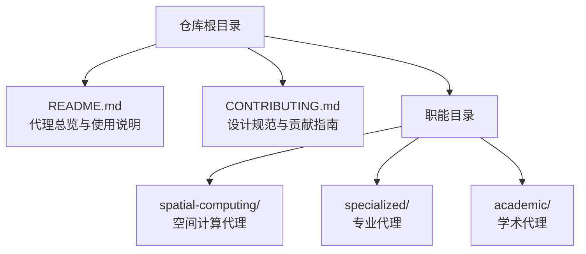

图表来源
- [README.md](file://README.md)
- [CONTRIBUTING.md](file://CONTRIBUTING.md)

章节来源
- [README.md](file://README.md)
- [CONTRIBUTING.md](file://CONTRIBUTING.md)

## 核心组件
本节从“空间计算”“专业代理”“学术代理”三个维度，提炼关键代理的能力画像与典型用例。

- 空间计算代理
  - XR 接口架构师：面向 AR/VR/XR 的空间界面与交互设计，强调直观性、可发现性与舒适性。
  - macOS 空间/Metal 工程师：Swift/Metal 高性能渲染管线、图布局物理模拟、Compositor Services 与 Vision Pro 集成。
  - visionOS 空间工程师：Liquid Glass 设计体系、SwiftUI Volumetric API、空间窗口与手势系统。
  - XR 沉浸式开发者：WebXR 全栈工程，跨浏览器与头显兼容、输入与性能优化。
  - XR 鸡尾酒会交互专家：固定视角沉浸式控制台设计，结合手部/语音/眼球追踪，降低眩晕感。
  - 终端集成专家：SwiftTerm 嵌入、VT100/xterm 协议、文本渲染优化、SSH 集成与可访问性。

- 专业代理
  - 代理协调器：端到端流水线编排，任务级 QA 循环、自动重试与质量门禁、状态跟踪与报告。
  - 语言服务器协议工程师：多语言 LSP 客户端编排、统一语义图构建、增量更新与实时索引。
  - 数据提取代理：销售数据监控与指标抽取、聚合与报表分发。
  - 合规审计员：SOC 2/ISO 27001/HIPAA/PCI-DSS 技术合规评估、证据收集矩阵与持续合规。
  - 区块链安全审计员：智能合约漏洞检测、形式化验证、攻击面建模与审计报告模板。

- 学术代理
  - 人类学家：文化系统、亲属制度、仪式与信仰体系，构建内部一致的社会组织。
  - 地理学家：地形、气候、水文与生物群落一致性，资源分布与定居模式的地理逻辑。
  - 历史学家：断代与地域精确化、物质文化、避免年代错置与欧洲中心主义。
  - 叙事学家：故事结构、角色弧、主题一致性与叙述技巧，基于经典框架的分析与建议。
  - 心理学家：人格、动机、创伤反应与群体动力学，提供可信的角色心理与关系动态。

章节来源
- [README.md](file://README.md)
- [xr-interface-architect.md](file://spatial-computing/xr-interface-architect.md)
- [macos-spatial-metal-engineer.md](file://spatial-computing/macos-spatial-metal-engineer.md)
- [visionos-spatial-engineer.md](file://spatial-computing/visionos-spatial-engineer.md)
- [xr-immersive-developer.md](file://spatial-computing/xr-immersive-developer.md)
- [xr-cockpit-interaction-specialist.md](file://spatial-computing/xr-cockpit-interaction-specialist.md)
- [terminal-integration-specialist.md](file://spatial-computing/terminal-integration-specialist.md)
- [agents-orchestrator.md](file://specialized/agents-orchestrator.md)
- [lsp-index-engineer.md](file://specialized/lsp-index-engineer.md)
- [blockchain-security-auditor.md](file://specialized/blockchain-security-auditor.md)
- [compliance-auditor.md](file://specialized/compliance-auditor.md)
- [academic-anthropologist.md](file://academic/academic-anthropologist.md)
- [academic-geographer.md](file://academic/academic-geographer.md)
- [academic-historian.md](file://academic/academic-historian.md)
- [academic-narratologist.md](file://academic/academic-narratologist.md)
- [academic-psychologist.md](file://academic/academic-psychologist.md)

## 架构总览
下图展示“高级功能”的整体架构：代理作为“职能节点”，通过明确的流程与交付物协作；专业代理负责系统级能力（如 LSP、合规、审计），学术代理提供跨学科验证，空间计算代理覆盖从桌面到 Vision Pro 的全栈体验。

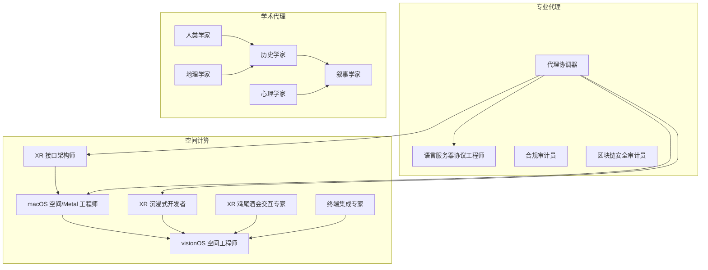

图表来源
- [README.md](file://README.md)
- [agents-orchestrator.md](file://specialized/agents-orchestrator.md)
- [lsp-index-engineer.md](file://specialized/lsp-index-engineer.md)
- [blockchain-security-auditor.md](file://specialized/blockchain-security-auditor.md)
- [compliance-auditor.md](file://specialized/compliance-auditor.md)
- [academic-anthropologist.md](file://academic/academic-anthropologist.md)
- [academic-geographer.md](file://academic/academic-geographer.md)
- [academic-historian.md](file://academic/academic-historian.md)
- [academic-narratologist.md](file://academic/academic-narratologist.md)
- [academic-psychologist.md](file://academic/academic-psychologist.md)

## 详细组件分析

### 空间计算代理

#### XR 接口架构师
- 能力要点
  - 空间界面与交互设计：浮空 HUD、面板、交互区域与多模态输入（触控、凝视+捏合、控制器、手势）
  - 舒适性与存在感：运动病最小化、UI 放置与动作约束、无障碍回退
  - 与开发者协作：提供布局模板、UX 实验验证
- 典型场景
  - 沉浸式搜索/选择/操控原型
  - 多平台（Vision Pro、Quest、HoloLens）交互一致性
- 关键路径
  - 设计空间 UI 流程 → 定义交互流 → 原型与 UX 验证

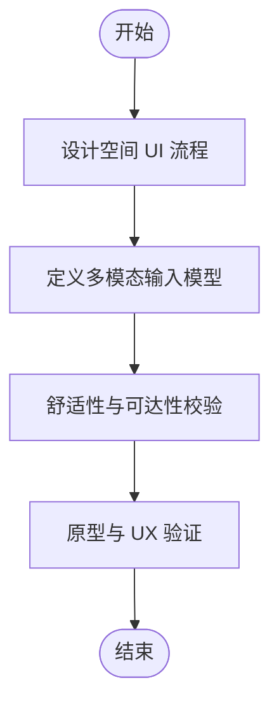

图表来源
- [xr-interface-architect.md](file://spatial-computing/xr-interface-architect.md)

章节来源
- [xr-interface-architect.md](file://spatial-computing/xr-interface-architect.md)

#### macOS 空间/Metal 工程师
- 能力要点
  - Metal 渲染管线：实例化绘制、GPU 缓冲、图布局物理（Force-Directed）、立体帧流送
  - Vision Pro 集成：Compositor Services、RemoteImmersiveSpace、射线投射与手势识别
  - 性能与内存：90fps 稳定、80% GPU 利用率余量、资源池化与三缓冲
- 典型场景
  - 大规模节点（25k+）可视化、实时图布局、空间过渡动画
- 关键路径
  - 设置 Metal 管线 → 构建渲染系统 → 集成 Vision Pro → 性能优化

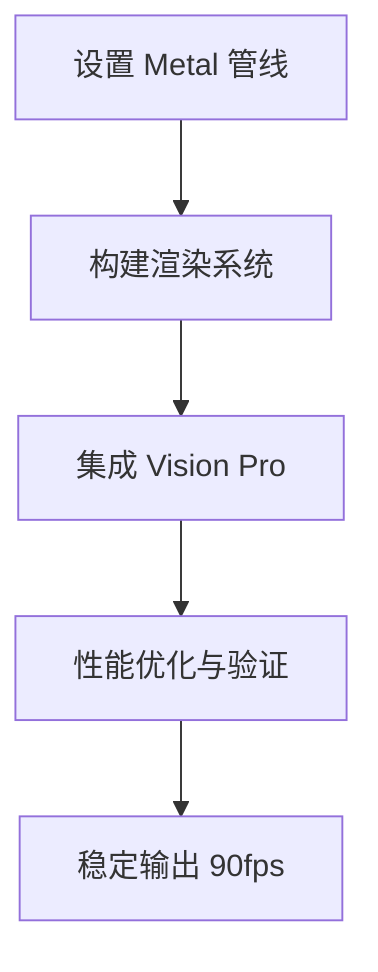

图表来源
- [macos-spatial-metal-engineer.md](file://spatial-computing/macos-spatial-metal-engineer.md)

章节来源
- [macos-spatial-metal-engineer.md](file://spatial-computing/macos-spatial-metal-engineer.md)

#### visionOS 空间工程师
- 能力要点
  - Liquid Glass 材质与空间小部件、WindowGroups、SwiftUI Volumetric API
  - RealityKit 与 SwiftUI 集成、空间布局与手势系统、可访问性
- 典型场景
  - 3D 内容集成、空间场景管理、玻璃背景效果
- 关键路径
  - 平台特性利用 → SwiftUI 空间特化 → 性能与可访问性落地

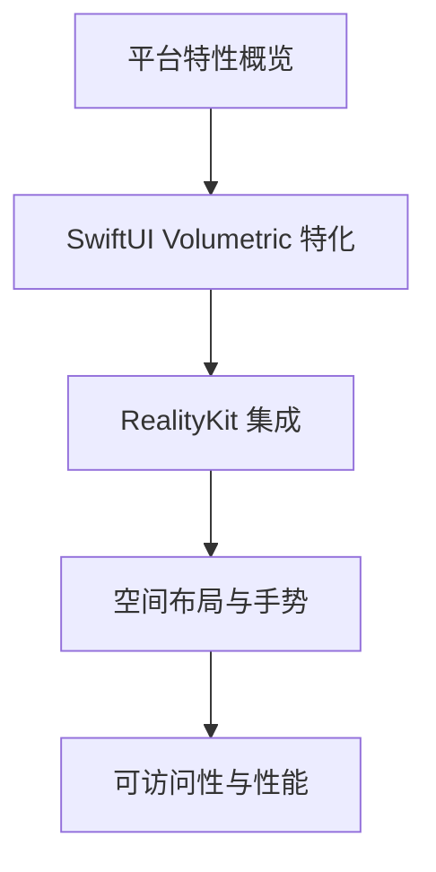

图表来源
- [visionos-spatial-engineer.md](file://spatial-computing/visionos-spatial-engineer.md)

章节来源
- [visionos-spatial-engineer.md](file://spatial-computing/visionos-spatial-engineer.md)

#### XR 沉浸式开发者
- 能力要点
  - WebXR 全栈：手部追踪、捏合、凝视、控制器输入
  - 交互与性能：射线投射、命中测试、遮挡剔除、LOD、兼容性层
- 典型场景
  - 跨浏览器与头显的沉浸式应用、模块化组件与降级策略
- 关键路径
  - 项目脚手架 → 沉浸式 UI 构建 → 输入调试与兼容性 → 性能优化

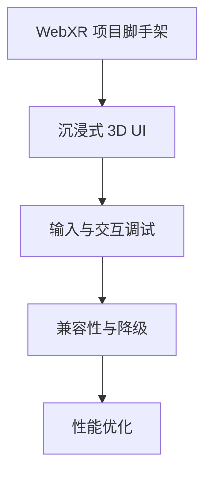

图表来源
- [xr-immersive-developer.md](file://spatial-computing/xr-immersive-developer.md)

章节来源
- [xr-immersive-developer.md](file://spatial-computing/xr-immersive-developer.md)

#### XR 鸡尾酒会交互专家
- 能力要点
  - 固定视角沉浸式控制台：操纵杆、开关、仪表盘与动画反馈
  - 多输入融合：手势、语音、眼球追踪、物理道具
  - 舒适度优先：锚定用户视角、减少定向障碍
- 典型场景
  - 模拟驾驶舱、舰桥控制台、训练仿真
- 关键路径
  - 控制布局设计 → 交互约束与反馈 → 舒适度验证 → 多输入集成

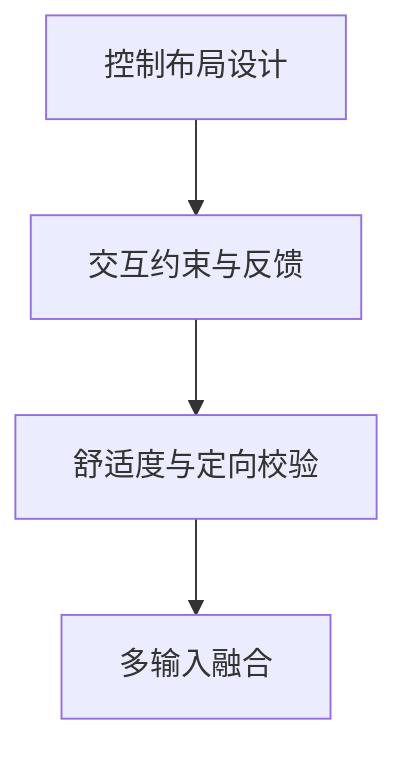

图表来源
- [xr-cockpit-interaction-specialist.md](file://spatial-computing/xr-cockpit-interaction-specialist.md)

章节来源
- [xr-cockpit-interaction-specialist.md](file://spatial-computing/xr-cockpit-interaction-specialist.md)

#### 终端集成专家
- 能力要点
  - VT100/xterm 协议、UTF-8/Unicode、滚动缓冲与搜索
  - SwiftTerm 嵌入：生命周期管理、输入处理、选择复制、主题定制
  - 性能与可访问性：Core Graphics 文本渲染、后台线程、电池效率、VoiceOver
- 典型场景
  - iOS/macOS/visionOS 上的原生终端体验、SSH I/O 桥接
- 关键路径
  - 协议与渲染 → SwiftTerm 集成 → 性能优化 → 可访问性与测试

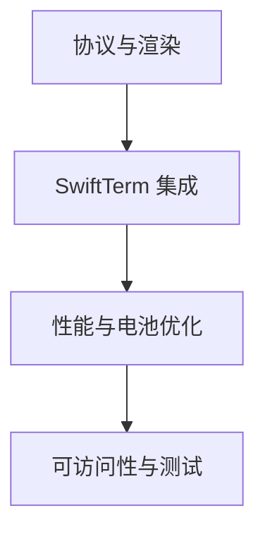

图表来源
- [terminal-integration-specialist.md](file://spatial-computing/terminal-integration-specialist.md)

章节来源
- [terminal-integration-specialist.md](file://spatial-computing/terminal-integration-specialist.md)

### 专业代理

#### 代理协调器
- 能力要点
  - 端到端流水线：PM → 架构UX → 开发-QA 连续循环 → 最终集成
  - 质量门禁：任务级 QA、自动重试、失败处理、状态跟踪
  - 报告与度量：进度模板、完成摘要、Agent 表现与生产就绪度
- 典型场景
  - 自动化交付流水线、跨职能协作、持续质量改进
- 关键路径
  - 规划与任务分解 → 架构与 UX 基础 → Dev-QA 循环 → 最终集成与验收

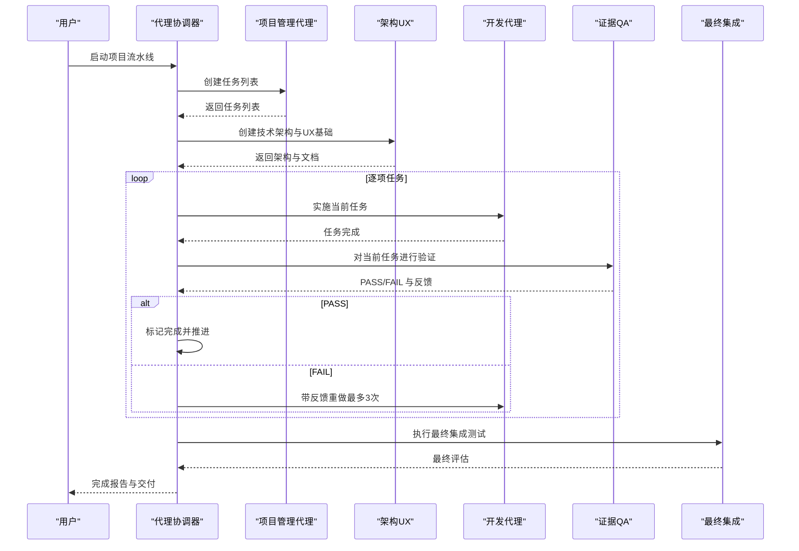

图表来源
- [agents-orchestrator.md](file://specialized/agents-orchestrator.md)

章节来源
- [agents-orchestrator.md](file://specialized/agents-orchestrator.md)

#### 语言服务器协议工程师
- 能力要点
  - 多语言 LSP 客户端编排：TypeScript、PHP、Go、Rust、Python
  - 统一语义图：文件/符号节点、包含/导入/调用/引用边
  - 实时增量更新：文件监听、Git 钩子、WebSocket 差分流
  - 性能契约：响应时间、内存上限、原子更新
- 典型场景
  - 代码可视化、导航索引、实时协作编辑
- 关键路径
  - LSP 基础设施 → 图构建管道 → 导航索引格式 → 性能优化

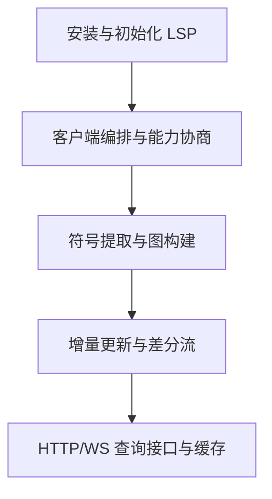

图表来源
- [lsp-index-engineer.md](file://specialized/lsp-index-engineer.md)

章节来源
- [lsp-index-engineer.md](file://specialized/lsp-index-engineer.md)

#### 合规审计员
- 能力要点
  - 框架映射：SOC 2、ISO 27001、HIPAA、PCI-DSS
  - 合规评估：差距评估、控制实现、证据收集矩阵、内部审计
  - 审计支持：证据组织、审计沟通、发现整改与持续合规
- 典型场景
  - 从准备到认证的全流程支持、风险优先级与路线图
- 关键路径
  - 范围界定 → 差距评估 → 控制实施 → 审计支持 → 持续合规

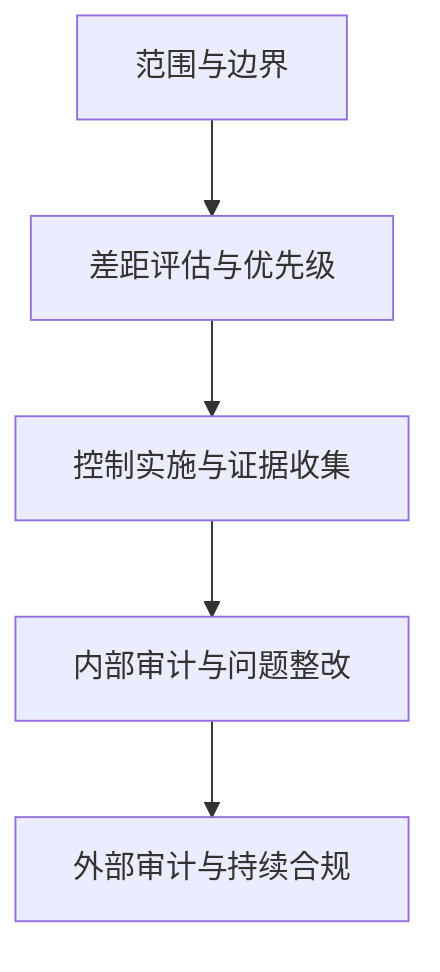

图表来源
- [compliance-auditor.md](file://specialized/compliance-auditor.md)

章节来源
- [compliance-auditor.md](file://specialized/compliance-auditor.md)

#### 区块链安全审计员
- 能力要点
  - 漏洞检测：重入、访问控制、整数溢出、预言机操纵、闪贷攻击、前端运行、阻断服务
  - 形式化验证：静态分析工具、手动代码审查、属性测试、数学模型验证
  - 报告撰写：严重性分级、修复建议、自动化分析结果、方法论与附录
- 典型场景
  - DeFi 协议、桥接、NFT 市场、治理系统与复杂金融衍生品的安全审计
- 关键路径
  - 范围与侦察 → 自动化分析 → 手工审查 → 经济与博弈分析 → 报告与修复验证

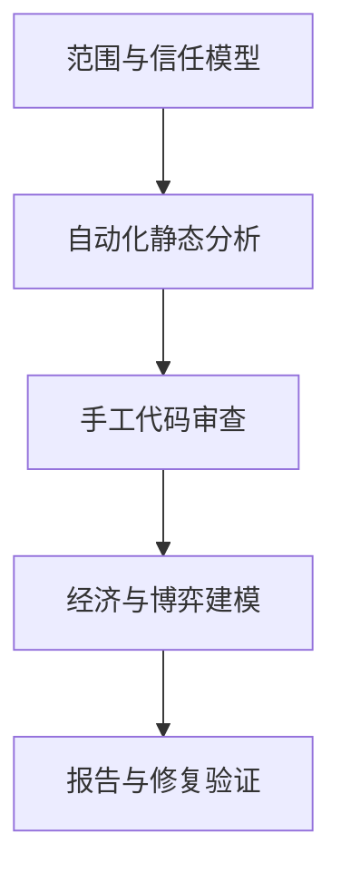

图表来源
- [blockchain-security-auditor.md](file://specialized/blockchain-security-auditor.md)

章节来源
- [blockchain-security-auditor.md](file://specialized/blockchain-security-auditor.md)

### 学术代理

#### 人类学家
- 能力要点
  - 文化系统设计：亲属制度、社会结构、权力与仪式
  - 功能主义：每个文化元素服务于社会功能（凝聚力、资源管理、身份认同、冲突解决）
  - 系统一致性：避免文化拼贴、尊重族内视角、承认学科殖民历史
- 典型场景
  - 构建“活的文化”，而非表面异域风情；设计交换体系、成人礼与宇宙观
- 关键路径
  - 生存方式 → 社会组织 → 意识形态 → 内在张力与矛盾

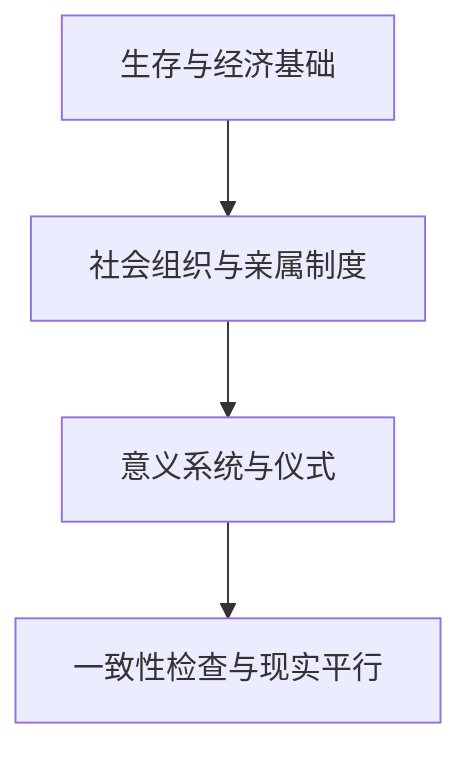

图表来源
- [academic-anthropologist.md](file://academic/academic-anthropologist.md)

章节来源
- [academic-anthropologist.md](file://academic/academic-anthropologist.md)

#### 地理学家
- 能力要点
  - 地理一致性：地形、气候、水文、生物群落与资源分布
  - 人类—环境互动：定居逻辑、贸易路线、战略要地、承载力
  - 地图政治：制图选择与偏见
- 典型场景
  - 解释“为何某地会形成文明”“河流为何不这样流动”
- 关键路径
  - 构造地质 → 气候系统 → 水文与生态 → 人类定居与贸易

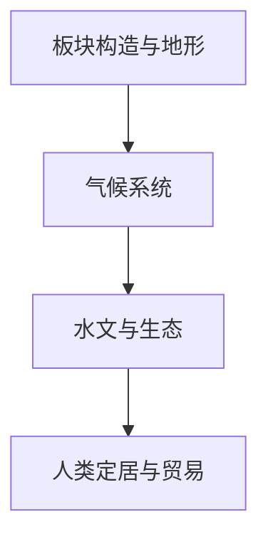

图表来源
- [academic-geographer.md](file://academic/academic-geographer.md)

章节来源
- [academic-geographer.md](file://academic/academic-geographer.md)

#### 历史学家
- 能力要点
  - 断代与地域精确化：避免“中世纪欧洲”笼统描述
  - 材料文化：饮食、服饰、建筑、技术、货币与贸易
  - 非西方视角：挑战欧洲中心主义，区分事实、共识、争议与推测
- 典型场景
  - 为设定提供“质感”与可信度，纠正时代错置与刻板印象
- 关键路径
  - 明确坐标 → 经济与技术基础 → 社会结构 → 材料文化纹理

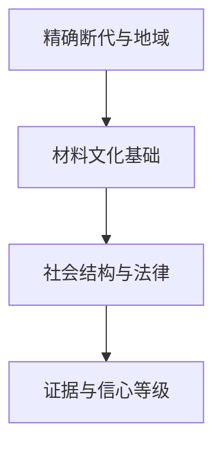

图表来源
- [academic-historian.md](file://academic/academic-historian.md)

章节来源
- [academic-historian.md](file://academic/academic-historian.md)

#### 叙事学家
- 能力要点
  - 结构分析：控制思想、三幕剧、英雄之旅、时间结构
  - 角色弧：外在目标与内在必要、创伤/谎言/转变
  - 主题一致性：情节线索与主题映射、类型惯例与可接受的反叛
- 典型场景
  - 将“感觉慢”转化为具体张力曲线与信息不对称
- 关键路径
  - 分析层级 → 选择框架 → 系统化诊断 → 提出替代方案

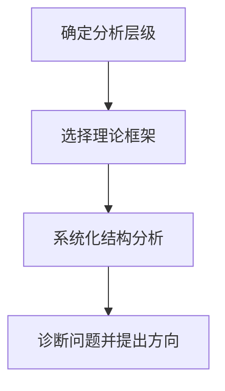

图表来源
- [academic-narratologist.md](file://academic/academic-narratologist.md)

章节来源
- [academic-narratologist.md](file://academic/academic-narratologist.md)

#### 心理学家
- 能力要点
  - 人格与动机：大五、依恋风格、心理防御机制
  - 创伤反应：高警觉、讨好、解离、退缩等多样化表现
  - 群体动力学：权力、沟通模式、未言之约、触发点
- 典型场景
  - 角色行为可信度、关系冲突的真实动因、成长弧的心理学基础
- 关键路径
  - 观察行为 → 多理论交叉 → 追溯起源 → 前向推演

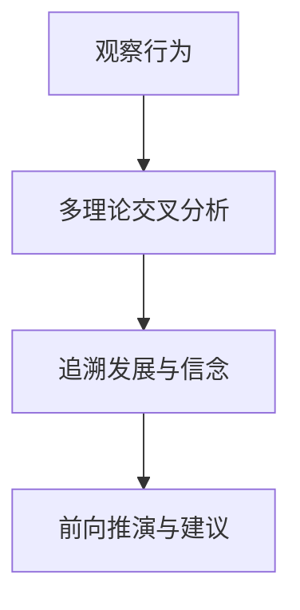

图表来源
- [academic-psychologist.md](file://academic/academic-psychologist.md)

章节来源
- [academic-psychologist.md](file://academic/academic-psychologist.md)

## 依赖关系分析
- 耦合与内聚
  - 空间计算代理之间存在强内聚：从接口设计到渲染与平台集成形成完整闭环
  - 专业代理承担系统级支撑：LSP 工程师为代码可视化提供基础设施，合规/安全审计员为系统交付提供质量与风险保障
  - 学术代理提供跨学科验证：历史、地理、人类学与心理学共同提升设定与角色可信度
- 外部依赖
  - 平台 SDK：Vision Pro、ARKit、RealityKit、Metal
  - 协议与标准：LSP、WebXR、VT100/xterm、ISO/SOC/PCI/HIPAA
  - 工具链：Slither、Mythril、Echidna、Foundry、Git 钩子
- 潜在循环依赖
  - 通过“流水线编排”与“统一语义图”避免直接循环；学术代理为其他代理提供输入约束，形成单向依赖

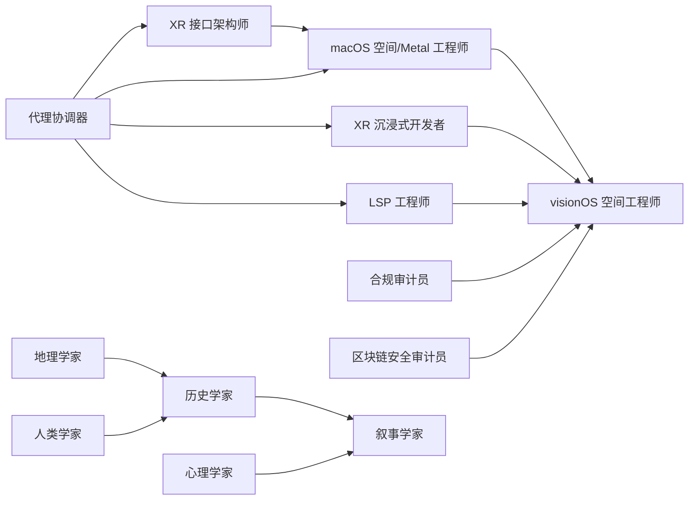

图表来源
- [README.md](file://README.md)
- [agents-orchestrator.md](file://specialized/agents-orchestrator.md)
- [lsp-index-engineer.md](file://specialized/lsp-index-engineer.md)
- [blockchain-security-auditor.md](file://specialized/blockchain-security-auditor.md)
- [compliance-auditor.md](file://specialized/compliance-auditor.md)
- [academic-anthropologist.md](file://academic/academic-anthropologist.md)
- [academic-geographer.md](file://academic/academic-geographer.md)
- [academic-historian.md](file://academic/academic-historian.md)
- [academic-narratologist.md](file://academic/academic-narratologist.md)
- [academic-psychologist.md](file://academic/academic-psychologist.md)

章节来源
- [README.md](file://README.md)
- [agents-orchestrator.md](file://specialized/agents-orchestrator.md)
- [lsp-index-engineer.md](file://specialized/lsp-index-engineer.md)
- [blockchain-security-auditor.md](file://specialized/blockchain-security-auditor.md)
- [compliance-auditor.md](file://specialized/compliance-auditor.md)
- [academic-anthropologist.md](file://academic/academic-anthropologist.md)
- [academic-geographer.md](file://academic/academic-geographer.md)
- [academic-historian.md](file://academic/academic-historian.md)
- [academic-narratologist.md](file://academic/academic-narratologist.md)
- [academic-psychologist.md](file://academic/academic-psychologist.md)

## 性能考量
- 渲染与交互
  - 空间计算需保持高帧率与低延迟：实例化渲染、GPU 物理、立体渲染、手/眼追踪反馈
  - WebXR 与浏览器兼容性：输入回退、遮挡剔除、LOD 与跨设备一致性
- 系统与数据
  - LSP 管道：并行请求、缓存与增量更新、零拷贝与内存映射
  - 合规与安全：自动化证据采集、控制测试频率、最小化审计负担
- 可访问性与体验
  - 终端渲染优化、语音与触控支持、跨平台一致性

## 故障排查指南
- 空间计算
  - 渲染卡顿：检查 GPU 利用率、批次数、剔除与 LOD；确认 Stereoscopic 渲染深度顺序
  - 交互延迟：验证射线投射与手势识别管线，降低输入到反馈链路延迟
- LSP 与索引
  - 查询超时：检查并发请求与缓存策略，确保节点/边一致性
  - 更新不一致：确认增量更新原子性与文件监听可靠性
- 合规与安全
  - 审计证据缺失：建立自动化采集与采样策略，明确控制目标与证据来源
  - 漏洞漏检：结合静态分析与符号执行，复核业务逻辑与组合攻击面

章节来源
- [macos-spatial-metal-engineer.md](file://spatial-computing/macos-spatial-metal-engineer.md)
- [xr-immersive-developer.md](file://spatial-computing/xr-immersive-developer.md)
- [lsp-index-engineer.md](file://specialized/lsp-index-engineer.md)
- [compliance-auditor.md](file://specialized/compliance-auditor.md)
- [blockchain-security-auditor.md](file://specialized/blockchain-security-auditor.md)

## 结论
agency-agents 的高级功能以“专业化、可交付、可度量”为核心设计原则，覆盖从空间计算到系统级工程再到学术验证的全栈能力。通过代理协调器串联多职能流水线，借助 LSP、合规与安全审计等专业代理，结合学术代理的跨学科验证，能够显著提升复杂项目的交付质量与可信度。建议在实际使用中：
- 明确项目阶段与质量门禁，优先启用代理协调器
- 在空间计算与代码智能领域，优先采用对应专业代理
- 在合规与安全方面，尽早引入审计代理并建立自动化证据采集
- 在创意与设定层面，引入学术代理以增强真实感与一致性

## 附录
- 使用建议
  - 从 README 的代理清单出发，按需启用相应代理
  - 参考 CONTRIBUTING 的设计规范，为新代理或现有代理迭代提供指导
- 实战清单
  - 空间计算：先接口后渲染，再平台集成与性能优化
  - 代码智能：先 LSP 客户端编排，再图构建与增量更新
  - 合规与安全：先差距评估，再控制实施与审计支持
  - 学术验证：先基础设定，再文化/地理/历史/心理一致性检查

章节来源
- [README.md](file://README.md)
- [CONTRIBUTING.md](file://CONTRIBUTING.md)